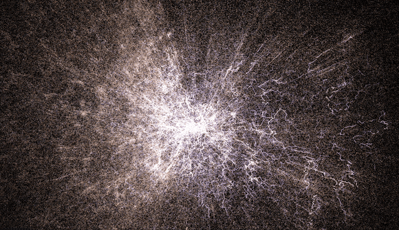
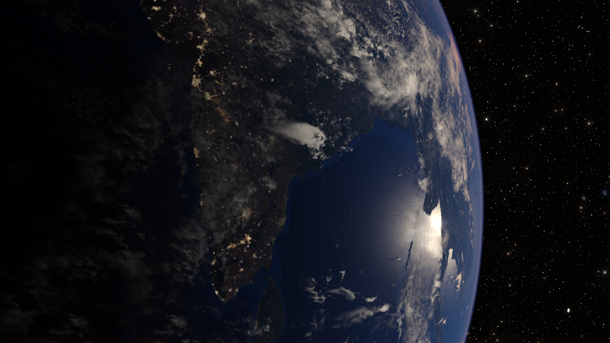
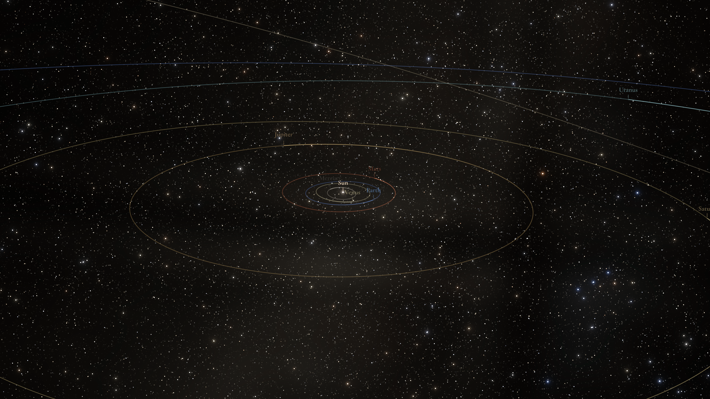
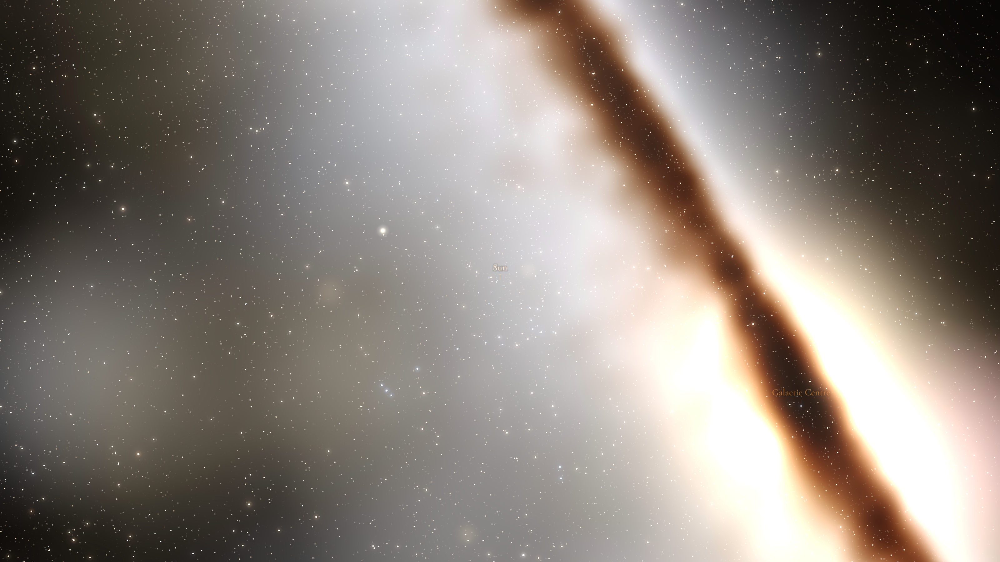
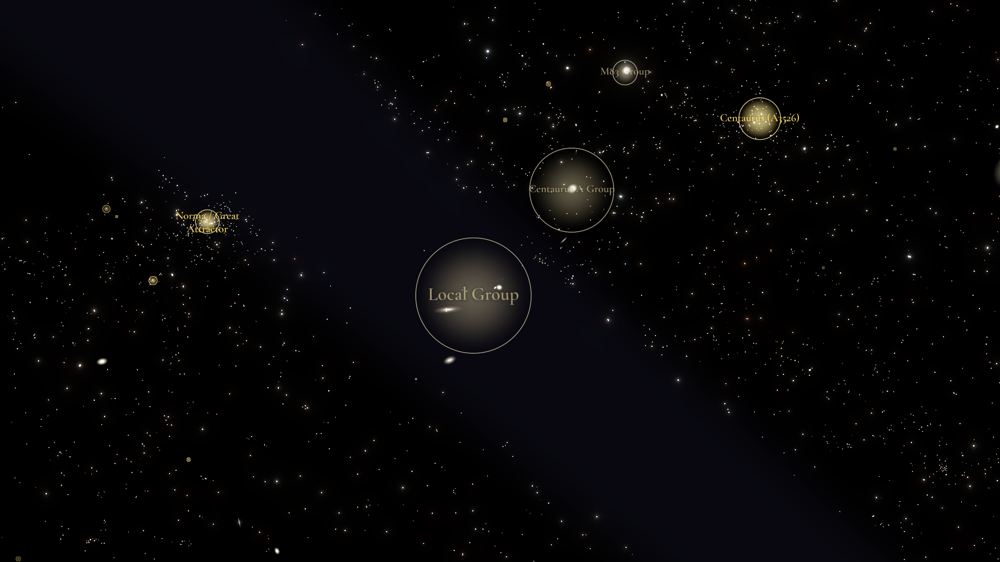
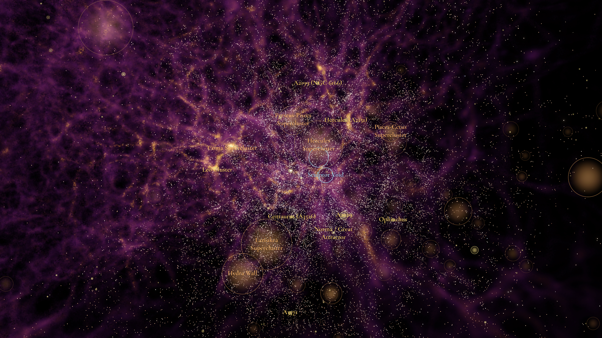

# skymap

> A continuous, true-scale descent from Earth's surface to the edge of the observable universe, built from real catalog data — in your browser, with WebGPU.

[](https://github.com/rulkens/skymap/actions/workflows/ci.yml)
[](LICENSE)
[](https://nodejs.org)
[](https://www.typescriptlang.org)
[](https://doi.org/10.5281/zenodo.20037028)

<!-- TODO capture: replace with a fresh hero still or short descent GIF -->



**[Live demo →](https://skymap.rulkens.com)** &nbsp; · &nbsp; Chrome 113+ &nbsp; · &nbsp; Edge 113+ &nbsp; · &nbsp; Firefox 141+ (145+ on Apple Silicon macOS) &nbsp; · &nbsp; Safari 26+

## The zoom

Skymap starts at Earth's surface, human scale, around 10⁷ meters, and ends past the observable universe's horizon, around 10²⁶ meters — nineteen orders of magnitude, rendered as one continuous scene rather than a series of jump cuts between separately-scaled views. Zoom out from Earth and you pass through the solar system's planets moving on a live clock, the S-stars circling Sagittarius A\*, a Milky Way built from real Gaia stars, the procedural galactic disk that marks "you are here," and out to the cosmic web: roughly three million real galaxies stretching toward the horizon, threaded by filaments and structure.

A guided tour, "The Long Way Out," walks the whole descent with narration and timed camera moves. Outside the tour, free orbit controls and a Cmd+K search reach the same scene directly — useful for teaching large-scale structure, general astronomy outreach, or just browsing the underlying catalogs.

## Highlights

- Cosmic web of roughly 3 million galaxies from SDSS, 2MRS, GLADE, and Milliquas, each rendered through a three-stage level of detail — dot, then [procedural disk](docs/science.md#galaxy-level-of-detail), then real thumbnail — as you approach
- A [DisPerSE filament skeleton](docs/DATA.md#5-cosmic-web-filaments-disperse) tracing the cosmic web's ridges, and an MCPM slime-mould density volume underneath it
- Cluster, supercluster, void, and group markers with labels, drawn from MCXC, MSCC, and other VizieR structure catalogs
- A curated famous-galaxy atlas — hand-picked high-resolution thumbnails for the Messier/NGC greatest hits, searchable via Cmd+K
- A procedural Milky Way anchored at the origin, pickable, marking "you are here"
- A Gaia DR3 star field of about 16.8 million stars, extended by the GCNS and Hipparcos-2 supplements; stars large enough to resolve render as true-scale spheres
- The S-stars orbiting Sagittarius A\* on their measured Keplerian orbits, with trails
- The solar system on a live clock — every planet including Pluto and Charon, Saturn's rings, conic orbit trails, body glints, and the Sun with bloom
- A photoreal Earth — cubesphere PBR shading, night lights, normal-mapped relief, a cloud shell, and streamed virtual-texture surface tiles down to city scale
- Time simulation — jump to a date, step the simulation rate, share a moment via a `#t=` deep link
- A Cmd+K command palette searching the famous atlas, roughly 48,000 PGC name aliases, and named structures, plus `#focus=`/`#orientation=` deep links for camera state
- Off by default, toggled in the Settings panel: DESI DR1 pencil cones, the CF4++ peculiar-velocity flow field, the 88 classical constellations, and the CF-4 dark-matter density volume
- A debug panel (`d`) with per-pass GPU timings and pass toggles

## Gallery

<!-- TODO capture -->



_Earth from low orbit: PBR cubesphere shading, night-side city lights, and a streamed virtual-texture surface tile resolving detail beyond the whole-globe base map._

<!-- TODO capture -->



_The solar system at the current simulated time — planets on their measured orbits, conic trails, Saturn's rings, and the Sun with HDR bloom._

<!-- TODO capture -->



_Zooming out from the Sun: the real Gaia DR3 star field crossfades into the procedural Milky Way disk that anchors the scene's "you are here" point._

<!-- TODO capture -->



_The local volume, tens of Mpc across — famous-catalog galaxies with curated thumbnails, structure labels, and the filament overlay threading between them._

<!-- TODO capture -->



_Supercluster scale, hundreds of Mpc across — the galaxy point cloud, the DisPerSE filament skeleton, and the MCPM cosmic-web volume drawn together._

## The data

Every pixel traces back to a real catalog, survey, or mission dataset. This table is deliberately terse — [ATTRIBUTIONS.md](ATTRIBUTIONS.md) is the authoritative credit list, with full citations and license terms for everything below.

**Sky**

| Source                           | Contributes                                                             |
| -------------------------------- | ----------------------------------------------------------------------- |
| SDSS DR17 (spectroscopic)        | Deep northern spectroscopic slice, ~500k galaxies                       |
| 2MRS                             | All-sky near-IR redshift survey, local volume in every direction        |
| GLADE v2.3                       | All-sky million-galaxy compilation, fills SDSS's footprint gaps         |
| Milliquas v8                     | ~940k spectroscopic quasars and AGN; off by default                     |
| DESI DR1 LSS                     | Deep pencil cones toward Corona Borealis; off by default                |
| Gaia DR3 + GCNS + Hipparcos-2    | ~16.8M Milky Way stars, local 100 pc supplement, naked-eye bright stars |
| Famous atlas                     | Curated Messier/NGC thumbnails and editorial descriptions               |
| MCXC + MSCC + VizieR structures  | Cluster, supercluster, void, and group markers                          |
| DisPerSE filaments               | Derived cosmic-web skeleton, computed offline from the point cloud      |
| CF-4 density (Courtois 2025)     | Dark-matter density volume; off by default                              |
| MCPM cosmic web VAC (Wilde 2023) | Slime-mould cosmic-web density volume                                   |
| CF4++ flow field                 | Peculiar-velocity streamline field; off by default                      |

**Solar system**

| Source                                        | Contributes                                                     |
| --------------------------------------------- | --------------------------------------------------------------- |
| Blue Marble Next Generation + EOX s2cloudless | Earth whole-globe imagery and a deeper Sentinel-2 tile band     |
| Planet, moon, and ring textures               | Solar System Scope, USGS Astrogeology, and NASA mission mosaics |

## Quickstart

Requires Node 20+.

```bash
npm install
npm run dev
```

Open http://localhost:5173 — drag to orbit, scroll to zoom. Without any real data files present, the renderer falls back to 100,000 synthetic galaxies distributed in a sphere, enough to verify the pipeline end to end.

For real data, pull the prebuilt catalogs:

```bash
npm run fetch-data
```

This downloads the deployed catalog, star, structure, and filament bins from R2 into `public/data/` — everything the live site loads by default, at every tier. See [docs/DATA.md](docs/DATA.md) for the full raw-catalog pipeline, if you want to build the binaries yourself instead of pulling them prebuilt.

The code is documented didactically throughout — if you're also looking to learn WebGPU, GPU picking, or the basics of cosmological coordinate math, the source is meant to be read.

## How it works

WebGPU and the per-frame render loop are inherently imperative, so they live in a long-running engine that the React UI subscribes to via callbacks rather than owns directly; React holds the DOM and UI-relevant state, the engine holds everything that updates 60 times a second. The engine doesn't run a continuous render loop — it renders on demand, waking only when an event handler touches render-affecting state and going idle again once nothing is moving. Every visible pass draws into a single `rgba16float` HDR accumulation target with a reversed-Z depth buffer, tone-mapped to the display in one pass at the end of the frame; a floating-origin camera keeps precision intact across the full 10⁷–10²⁶ meter scale range. Catalog data ships as five small binary formats, tiered and content-hashed, streamed from R2 through a boot-fetched manifest:

- **SKMP v9** — galaxies, 64 bytes per row
- **SKST v1** — stars
- **CCAT v1** — structures (clusters, superclusters, voids, groups)
- **SCFD v3** — scalar fields (density and flow volumes)
- **FILA v1** — filaments

See [docs/RENDERER.md](docs/RENDERER.md) for the renderer map and its hard-won WebGPU landmines, [docs/DATA.md](docs/DATA.md) for the data pipeline and binary format details, and [docs/adrs/](docs/adrs/) for the architectural decision records behind the engine/state split.

## Dev tools

- Three renderer dev tools ship as deployed pages alongside the main app: [/galaxy/](https://skymap.rulkens.com/galaxy/) (procedural Hubble-sequence galaxy + HDR bloom), [/mcpm/](https://skymap.rulkens.com/mcpm/) (MCPM cosmic-web workbench), and [/flow/](https://skymap.rulkens.com/flow/) (CF4++ flow-field visualizer)
- `npm run perf` — a headless GPU-timing harness for measuring renderer changes before and after
- `npm run record-tour` — an offline 4K recorder for the guided tour
- ~1,150 test files under Vitest

## Direction

- Extend the descent with more real data and fewer procedural stand-ins, rather than new scales for their own sake
- Comoving distance via a proper ΛCDM integration, replacing the current linear Hubble's-law approximation
- Spatial chunking so denser catalogs — SDSS's full photometric catalog is roughly a billion objects — become tractable past the current few-million-point ceiling
- Broader WebGPU coverage as it lands on more browsers and platforms

The living list of what's actually queued is [docs/BACKLOG.md](docs/BACKLOG.md).

## Cite, credit, and license

If you use skymap in a publication, talk, or derived work, please cite it via the metadata in [CITATION.cff](CITATION.cff) — GitHub's "Cite this repository" sidebar button exposes both BibTeX and APA forms. The catalog data, imagery, and shaders skymap displays carry their own citation requirements; see [ATTRIBUTIONS.md](ATTRIBUTIONS.md) for the full list.

Skymap's source code is MIT-licensed — see [LICENSE](LICENSE). Catalog data, imagery, and external service usage carry their own licensing terms (CC-BY-SA, public domain, publication-citation, and so on); ATTRIBUTIONS.md again has the full enumeration.

[CLAUDE.md](CLAUDE.md) at the repo root is onboarding guidance for AI coding assistants. It isn't load-bearing for the build or runtime — it's there because parts of this project were developed with AI assistance, and that context is useful for future AI-assisted edits.
