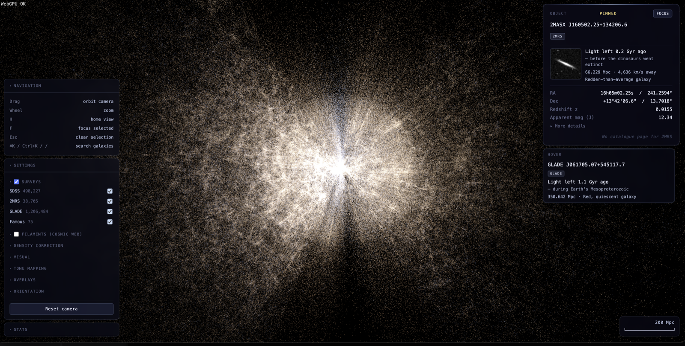
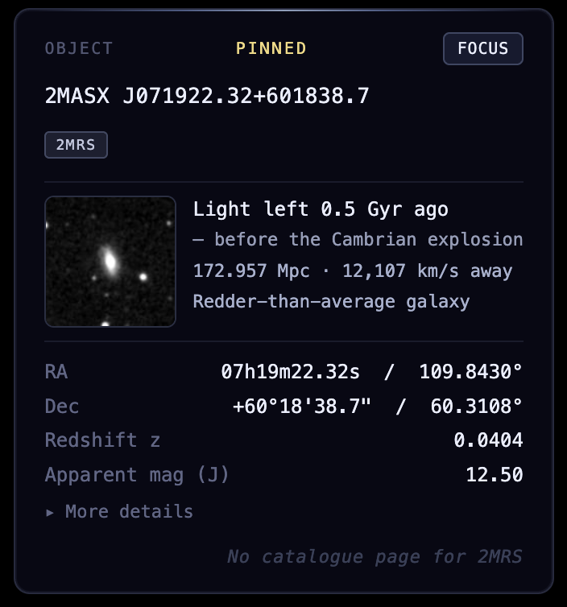
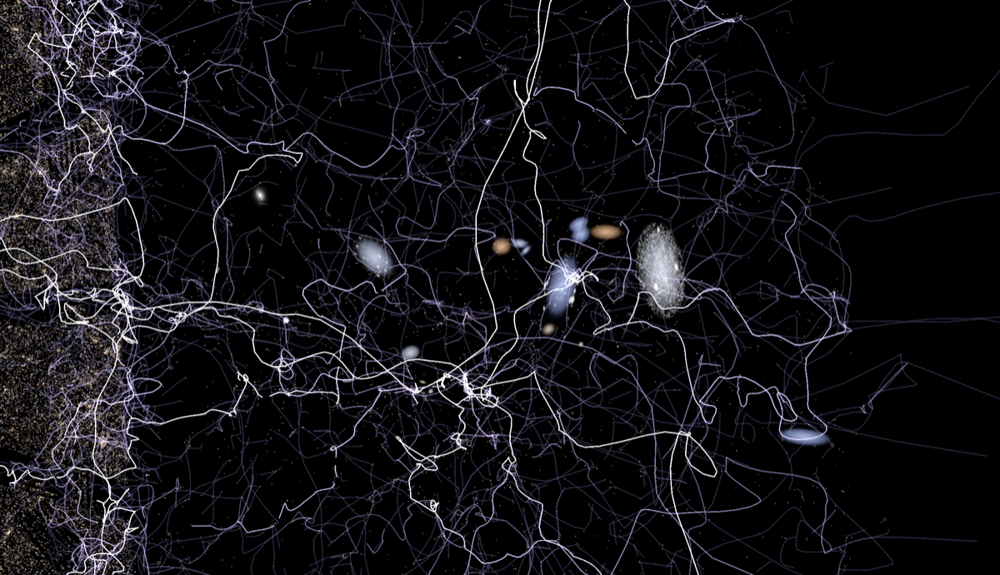
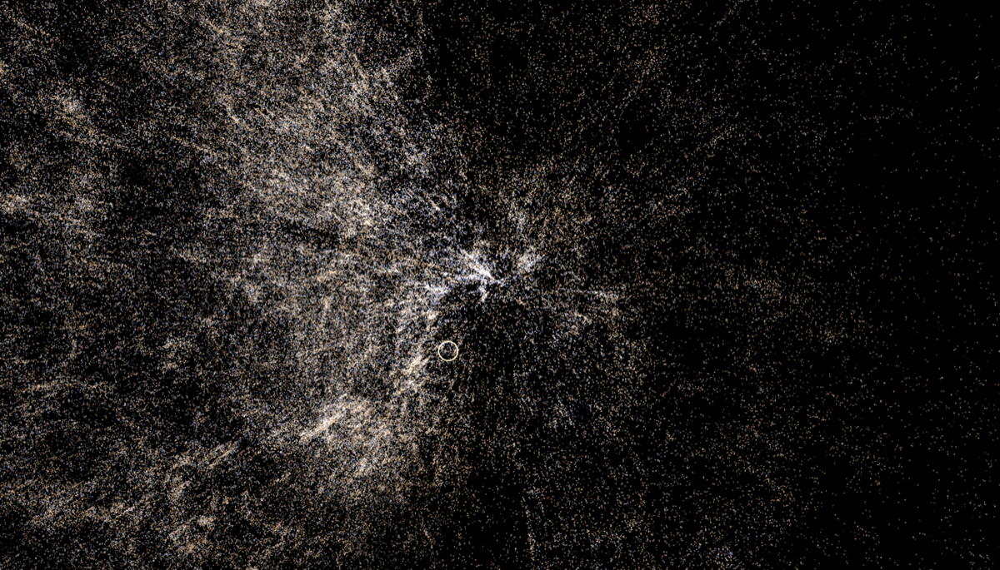
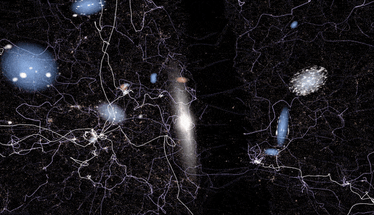
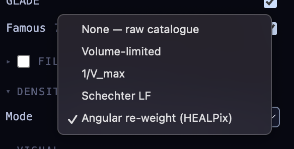

# skymap

> An interactive WebGPU 3D explorer for the SDSS, GLADE, and 2MRS galaxy catalogs — fly through millions of galaxies in your browser.

[](https://github.com/rulkens/skymap/actions/workflows/ci.yml)
[](LICENSE)
[](https://nodejs.org)
[](https://www.typescriptlang.org)
[](https://doi.org/10.5281/zenodo.20037028)


**[Live demo →](https://skymap.rulkens.com)** &nbsp; · &nbsp; Chrome 113+ &nbsp; · &nbsp; Edge 113+ &nbsp; · &nbsp; Firefox 141+ &nbsp; · &nbsp; Safari 26+

Built in TypeScript with React for the UI. Hover or click any galaxy to see its sky coordinates, redshift, lookback time, and catalog metadata; pin one to compare against another; explore the cosmic-web wedge in 3D with mouse-driven orbit controls.

The code is documented didactically throughout — if you're also looking to learn WebGPU, GPU picking, or the basics of cosmological coordinate math, the source is meant to be read.

## Screenshots



_The full overlay surface — left stack (Navigation cheatsheet, Settings panel, FPS / counts) and the InfoCard pinned to a selected galaxy on the right, with the cosmic-web filament skeleton drawn over the point field._


_Segmented control at the top of the Settings panel hot-swaps the loaded dataset between three sizes: **Small** (~300k galaxies — mobile-friendly), **Medium** (~600k — default for laptops), and **Large** (~2.5M — full catalog). Tier choice on first paint is driven by viewport width; clicking a button re-fetches the relevant `.bin` files and re-uploads the GPU vertex buffers in place — no page reload._



_Close-up of the right-side InfoCard. Pinning a galaxy reveals lookback time (with an Earth-era reference line), comoving distance + recession velocity, equatorial coordinates in both sexagesimal and decimal form, redshift, apparent magnitude in the survey's native band, plus a thumbnail (DSS via CDS hips2fits for 2MRS / GLADE; SDSS DR18 ImgCutout for SDSS) and an external-catalogue link where one exists._



_Local Volume, roughly 10–20 Mpc across. Bright textured quads are Famous-catalog galaxies with hand-curated DESI Legacy thumbnails; the faint blue lattice is the DisPerSE filament overlay._



_Supercluster-scale view, roughly 200–400 Mpc across — thousands of galaxies clustering into a dense core with filaments radiating into surrounding voids._



_Zooming in: the dot dissolves into a procedural disk impostor (Gaussian bulge + exponential profile, 3D-oriented from catalog axis-ratio + position angle) and then into a real DESI thumbnail once the apparent size crosses the fetch threshold._



_Five density-correction modes selectable at runtime (None / Volume-limited / 1/V_max / Schechter LF / Angular re-weight via HEALPix), addressing Malmquist bias and pencil-beam survey-footprint artefacts. See the [Density correction](#density-correction-malmquist-bias) section below for the science behind each mode._

## Use cases

- **Teaching cosmic large-scale structure** — fly through the SDSS wedge and
  see filaments, voids, and the Sloan Great Wall directly, without needing to
  spin up a Jupyter notebook or a desktop visualisation suite.
- **Public outreach and general curiosity** — a browser-based way to
  experience the geometry of the local universe: how galaxies cluster, how
  far apart they really are, and how the Milky Way sits inside the cosmic
  web.
- **Galaxy-catalog browsing for the GW host-candidate community (potential).**
  Skymap loads GLADE because GLADE was designed for gravitational-wave
  host-candidate work; the actual probability-volume overlay isn't built yet,
  but I'm open to exploring it if there's genuine demand from someone in the
  follow-up community.

## Requirements

- **Node 20+**
- A **WebGPU-capable browser**. WebGPU has been a [Baseline web platform feature since January 2026](https://web.dev/blog/webgpu-supported-major-browsers); in practice that means:
  - **Chrome / Edge 113+** — desktop (since 2023) and Android 12+ on Qualcomm/ARM GPUs.
  - **Firefox 141+** — Windows (since July 2025).
  - **Firefox 145+** — macOS on Apple Silicon (Tahoe 26+); Linux & Android still in progress through 2026.
  - **Safari 26+** — macOS Tahoe 26, iOS 26, iPadOS 26, visionOS 26.

  Touch UX on phones / tablets is not yet polished — controls assume a mouse — but the WebGPU pipeline itself runs everywhere in the list.

## Quickstart (synthetic data)

```bash
npm install
npm run dev
```

Open http://localhost:5173 — drag to orbit, scroll to zoom. Without real data files present you'll see 100,000 synthetic galaxies distributed in a sphere. Enough to verify the renderer works end-to-end and to play with hover/select before you commit to a multi-megabyte download.

## What surveys do I actually need?

The renderer can ingest up to three galaxy catalogs in parallel. Each is just a list of galaxies with positions and brightnesses, but they cover the sky differently:

- **SDSS** (Sloan Digital Sky Survey) — a deep photographic + spectroscopic survey from a single 2.5 m telescope in New Mexico, covering roughly the northern third of the sky. Best dense coverage in its footprint; we use a slice of ~500 k galaxies.
- **2MRS** (2MASS Redshift Survey) — a smaller (~45 k), all-sky redshift survey concentrated on the local volume around the Milky Way. Useful for nearby galaxies in any direction.
- **GLADE** — a million-galaxy all-sky mega-catalog cross-matched from several surveys. Reaches roughly the same radial depth as SDSS, but covers the full sky — so its main contribution is filling in the celestial regions outside SDSS's northern footprint, while also extending well beyond 2MRS's local volume.
- **Milliquas v8** ([Flesch 2023, OJAp 6, 49](https://doi.org/10.21105/astro.2308.01505)) — the Million Quasars compilation: ~940 k spec-z type-I QSOs, BL Lacs, type-II AGN, and radio/X-ray candidates from the literature, deduplicated across source catalogs. Renders as point-source AGN alongside the galaxy surveys; hidden by default — toggle on in the SettingsPanel.
- **Gaia DR3 stars** — the raw inputs to skymap's Milky-Way star bin: the ~16.8 M `G<14` slice of the [Gaia DR3](https://doi.org/10.1051/0004-6361/202243940) main catalog with Bailer-Jones distances, the GCNS 100 pc supplement, and a Hipparcos-2 bright-star patch for the naked-eye stars Gaia saturates on. Stars rather than galaxies, so it's a separate build target — not one of the three galaxy catalogs above.

You can run with any one, any two, or all three. The renderer falls back to synthetic data if no `.bin` files are present.

## Loading real data

The renderer fetches the SDSS / 2MRS / GLADE galaxy-catalog bins at startup (from `/data/galaxy-catalog/v9/`, resolved through the boot-fetched `manifest.json` — see [docs/DATA.md](docs/DATA.md)), using whichever are present. The pipeline below produces those files from raw catalog downloads.

### 1. Download the catalogs

| Survey      | Source                                                                                     | File / Notes                                                                                                                                                                                             |
| ----------- | ------------------------------------------------------------------------------------------ | -------------------------------------------------------------------------------------------------------------------------------------------------------------------------------------------------------- |
| SDSS        | [SkyServer SQL](https://skyserver.sdss.org/dr18/SearchTools/sql)                           | Run the query below; export as CSV.                                                                                                                                                                      |
| 2MRS        | [VizieR J/ApJS/199/26](https://vizier.cds.unistra.fr/viz-bin/VizieR?-source=J/ApJS/199/26) | `table3.dat`, 233-byte fixed-width, 44,599 rows, ~10 MB. Drop into `data/raw/2mrs/2mrs_table3.dat`.                                                                                                      |
| GLADE       | [VizieR VII/281](https://vizier.cds.unistra.fr/viz-bin/VizieR?-source=VII/281)             | `glade2.3.dat`, 256-byte fixed-width, 3.26 M rows, ~838 MB. Drop into `data/raw/glade/glade2.3.dat`.                                                                                                     |
| Milliquas   | [quasars.org](https://quasars.org/milliquas.htm)                                           | Run `npm run fetch-milliquas` — pulls the 31 MB zip, verifies SHA-256, unpacks to `data/raw/milliquas/milliquas.txt`.                                                                                    |
| Gaia DR3    | [ESA Gaia archive (TAP)](https://gea.esac.esa.int/archive/)                                | Run `npm run fetch-gaia` — pages the `G<14` main catalog + Bailer-Jones distances via ADQL into `data/raw/gaia/gaia_page_*.csv`. ~2 GB total; gated behind a `--yes` (or interactive) size confirmation. |
| GCNS        | [ESA Gaia archive (TAP)](https://gea.esac.esa.int/archive/)                                | Fetched automatically by `npm run fetch-gaia` — the 100 pc nearby-star supplement to `data/raw/gaia/gcns_main.csv`.                                                                                      |
| Hipparcos-2 | [VizieR I/311](https://vizier.cds.unistra.fr/viz-bin/VizieR?-source=I/311)                 | Fetched automatically by `npm run fetch-gaia` — `hip2.dat` (~33 MB) + Gaia cross-match to `data/raw/gaia/`.                                                                                              |

GLADE alone subsumes 2MPZ and 6dFGS — the GLADE team has already cross-matched and deduplicated 2MPZ + 2MASS XSC + HyperLEDA + GWGC + SDSS-DR12Q, so a single download replaces what would otherwise be three.

#### SDSS query

Go to the [DR18 SQL Search](https://skyserver.sdss.org/dr18/SearchTools/sql) and run:

```sql
SELECT TOP 500000
  p.objID, p.ra, p.dec, s.z,
  p.modelMag_u, p.modelMag_g, p.modelMag_r, p.modelMag_i, p.modelMag_z,
  p.expAB_r, p.expPhi_r, p.deVAB_r, p.deVPhi_r, p.fracDeV_r,
  p.petroR50_r, p.petroR90_r
FROM SpecObj AS s
JOIN PhotoObjAll AS p ON s.bestObjID = p.objID
WHERE
  s.class = 'GALAXY'
  AND s.zWarning = 0
  AND s.z BETWEEN 0.001 AND 0.3
```

Choose **CSV** as the output format. The columns break down into three groups:

- **Photometry** (`modelMag_u/g/r/i/z`) — brightness in five colour bands; drives the per-galaxy colour ramp.
- **Shape / orientation** (`expAB_r`, `expPhi_r`, `deVAB_r`, `deVPhi_r`, `fracDeV_r`) — axis ratio and position angle from two profile fits, blended by `fracDeV_r`. Drives the elliptical billboard mask and 3D disk plane.
- **Size** (`petroR50_r`, `petroR90_r`) — half-light and 90%-light radii in arcsec; the parser converts them to physical kpc using each galaxy's redshift.

> Need more than the 500 k row limit? Use [CasJobs](https://skyserver.sdss.org/casjobs) instead — same query, no timeout, larger result quotas.

### 2. Build the binary files

```bash
npm run build-all -- \
  --sdss    "data/raw/sdss/Skyserver_SQL.csv" \
  --twomrs  data/raw/2mrs/2mrs_table3.dat \
  --glade   data/raw/glade/glade2.3.dat \
  --out-dir public/data
```

Omit any `--xxx` flag you don't have — the merger treats missing inputs as empty and skips writing that output file. So `--sdss only` is a fine single-survey workflow.

The tool parses each catalog, runs cross-match dedup using priority **SDSS > 2MRS > GLADE**, then writes v9 binary files under `public/data/galaxy-catalog/v9/` with content-hashed names (e.g. `sdss.<hash>.bin`, `2mrs.<hash>.bin`, `glade.<hash>.bin` — see [docs/DATA.md](docs/DATA.md)). Sample run on the full inputs: 500 k SDSS / 41 k 2MRS / 2.1 M GLADE galaxies after dedup, ≈ 32 + 2.6 + 130 MB on disk.

### 3. (Optional) Enrich with real galaxy orientations

2MRS and GLADE don't ship with shape/orientation columns, so by default those galaxies render with deterministic-but-fake orientations (random per galaxy, stable across reloads). You can fetch real orientation data from external services:

```bash
npm run fetch-2mass-xsc    # ~5 minutes; adds PA + axis-ratio for 2MRS galaxies
npm run fetch-hyperleda    # ~1 hour; adds PA + axis-ratio for GLADE galaxies
```

- `fetch-2mass-xsc` queries the 2MASS Extended Source Catalog and writes `data/raw/2mrs/2mass_xsc_pa.csv`. Quick — runs in roughly five minutes.
- `fetch-hyperleda` queries HyperLEDA at 4 concurrent requests across ~1.5 M PGCs and writes `data/raw/hyperleda/hyperleda_pa.csv`. Takes roughly **1 hour** end-to-end. The script is resumable — interrupt and restart safely.

#### HyperLEDA orientation cache: download instead of fetching

Running the full HyperLEDA fetch yourself takes an hour and hammers HyperLEDA's servers with ~1.5 M requests. A pre-computed cache is available from the same R2 bucket that serves the `.bin` catalog files — download it instead:

```bash
mkdir -p data/raw/hyperleda
curl -L -o data/raw/hyperleda/hyperleda_pa.csv.gz \
  https://skymap-data.rulkens.com/data/hyperleda_pa.csv.gz
gunzip data/raw/hyperleda/hyperleda_pa.csv.gz
```

The cache is the output of a completed `npm run fetch-hyperleda` run, gzipped with `-9` for transport. It's updated manually whenever a catalog refresh is synced to R2. If you need the absolute latest HyperLEDA values (e.g. after a new GLADE release), the `npm run fetch-hyperleda` path above still works — run it, then `gzip -k -9 data/raw/hyperleda/hyperleda_pa.csv` and follow the `npm run sync-r2` steps in CLAUDE.md to push a fresh copy.

Both files are picked up automatically by the next `npm run build-all`. Both commands are entirely optional; the renderer works without them.

### 4. Reload

The browser fetches all available files in parallel at startup. Surveys arrive progressively. The settings panel (bottom-left) has per-survey checkboxes for toggling sources on and off.

### Per-survey colour indices

Each survey is coloured by its own most-informative photometric pair, since the
five magnitude slots in the binary format carry different bands depending on
the source. The raw colour difference is normalised to the shader's
blue → white → red ramp at upload time, and a per-row K-correction coefficient
compensates for redshift band-shifting before the ramp is sampled. Rows whose
preferred bands aren't measured render with a fixed mid-ramp tint instead of
poisoning the ramp with NaN.

| Survey | Colour | Natural range | K per unit z | Why this k                                                       |
| ------ | ------ | ------------- | ------------ | ---------------------------------------------------------------- |
| SDSS   | u−g    | 0.5 .. 2.0    | 3.0          | Calibrated against the SDSS spectroscopic sample.                |
| GLADE  | B−J    | 0.5 .. 3.5    | 1.0          | Optical–NIR pair; B redshifts out of band slowly.                |
| 2MRS   | J−K    | 0.7 .. 1.1    | 0.0          | NIR colours are nearly redshift-invariant in 2MRS's z ≲ 0.1 box. |

## Famous galaxies (curated atlas)

> **Optional.** The renderer works fine without the famous-galaxies bin —
> survey galaxies still render and the InfoCard still works. Skip this
> section entirely if you only want the catalog data. Build it when you
> want curated names + hand-fetched high-quality thumbnails for the
> Messier / NGC greatest-hits.

A separate small catalog of well-known galaxies (Messier + NGC greatest-hits)
ships alongside the survey data. Entries appear with their curated names
in the InfoCard and are searchable via the **Cmd+K / Ctrl+K** command
palette. Their thumbnails are pre-processed transparent WebPs — most are
hand-curated from press and amateur-astrophotography sources (NOIRLab, ESO,
ESA/Hubble, Wikimedia Commons) via the famous-galaxy curator, with a Wikipedia
→ DESI Legacy auto-fetch fallback for the rest — so famous galaxies always
render at high quality, even for nearby objects (M31, M33) that survey catalogs
filter out as too close. Per-image credits and licences are recorded in
`data/famous_curated_overrides.json` and summarised in
[ATTRIBUTIONS.md](ATTRIBUTIONS.md).

Run order (only if you want the famous-galaxies atlas):

1. `npm run build-all` — produces `2mrs.bin` + `glade.bin`,
   which the famous build needs for cross-match.
2. `npm run fetch-famous-images` — downloads + processes thumbnails for any
   entries without a curated override (~30 s). Idempotent; pass `--force` to re-fetch.
3. `npm run build-famous` — produces `famous.bin` + `famous_galaxies_meta.json`.

### Adding more galaxies

The seed file is `data/famous_galaxies.seed.json`. Each entry needs:

| Field         | Type     | Notes                                                   |
| ------------- | -------- | ------------------------------------------------------- |
| `id`          | string   | URL-safe lower-case identifier (e.g. `m31`, `ngc-5128`) |
| `names`       | string[] | One or more names; first is the headline                |
| `ra`          | number   | Right Ascension in degrees, [0, 360)                    |
| `dec`         | number   | Declination in degrees, [-90, 90]                       |
| `distanceMpc` | number   | Curated distance in megaparsecs                         |
| `diameterKpc` | number   | Physical isophotal diameter in kpc                      |
| `type`        | string   | Hubble morphological type (free-form)                   |
| `description` | string   | 1-3 sentence editorial blurb                            |

After adding an entry, re-run `npm run fetch-famous-images && npm run build-famous`.

## Galaxy thumbnails

When you zoom in close to a galaxy, the renderer fetches its real image and
draws it as a textured billboard instead of the usual dot. The textured-quad
pass runs after the existing point pass, so the dot stays visible behind the
quad as a soft glow.

**How it decides which galaxies get textured:** the engine computes each
galaxy's on-screen apparent size from its real catalog-derived diameter (with
a 30 kpc fallback for galaxies whose source catalog doesn't carry size data),
and only galaxies whose apparent size exceeds 24 pixels get a thumbnail
fetched. Below the threshold the dot is all you get — keeps network traffic
bounded to the small handful of galaxies that are actually large on screen.

**Image sources:**

- **SDSS DR18 ImgCutout** is the primary source — high-resolution colour JPEGs covering ~1/3 of the sky (mostly northern).
- **CDS hips2fits** is the all-sky fallback for 2MRS/GLADE galaxies outside the SDSS footprint. Lower resolution, monochrome (DSS POSS-II red), but covers the entire celestial sphere and is CORS-safe.

**Cache:** thumbnails live in a single 2048×2048 RGBA8 GPU texture atlas with
256 slots of 128×128 pixels each. When the atlas is full, the slot whose
galaxy was least recently visible is evicted (LRU). A priority fetch queue
runs at most 4 concurrent downloads, picking the largest-on-screen pending
galaxies first so the most visually important thumbnails arrive first.

**Visual polish:** each quad uses a radial alpha falloff so the JPEG-square
outline fades into a soft galaxy-like blob rather than showing as a hard
rectangle against dark space.

**Toggle:** the Settings panel has a "Galaxy thumbnails" checkbox (default
on). Switch it off if you'd rather see the raw point cloud without network
traffic, or to compare the dot field with and without textures.

## Procedural galaxy disks

Between the dot field (small, screen-aligned billboard) and the real
thumbnail (large, downloaded JPEG), there's a middle band where a galaxy
is visibly large enough that the dot looks too sparse but the
thumbnail-fetch network round-trip would feel laggy. The renderer fills
that band with a third pass: a **procedural 3D-oriented disk impostor**
that runs entirely on the GPU, no network, no atlas.

**How it looks:** a soft elliptical disk with a brighter Gaussian bulge
in the middle and an exponential falloff outward. Hue comes from the
same colour-index ramp the points pass uses, so a galaxy's procedural
disk matches its companion point's colour exactly.

**Geometry:** each disk is a 3D quad fixed in world space, oriented by
the galaxy's catalog axis ratio (b/a → inclination via cos i) and
position angle (east of north). Foreshortening falls out of the
perspective projection naturally — orbit the camera and the projected
ellipse shape changes accordingly. See `disks.wgsl` for the basis-
construction derivation; the procedural pass reuses that math
verbatim so the textured-thumbnail pass and the procedural pass agree
at the crossfade boundary.

**Crossfade band:** apparent size 8 → 14 px. Below 8 px the dot is
fully bright and no disk renders. Inside the band a `t² (3 − 2t)`
smoothstep ramps the disk in while the dot fades out by the
complementary curve `1 − t² (3 − 2t)`; the two curves sum to exactly
1.0 across the band so the per-galaxy HDR contribution stays constant
through the transition (no double-bright donut). Above 14 px the
procedural disk is at full alpha; above 24 px the textured thumbnail
overlays it with higher fidelity.

**Why three passes (point + procedural + textured) rather than two:**
fetching a thumbnail for every galaxy that grows past a few pixels
would slam the SDSS/CDS endpoints and the atlas LRU. The procedural
pass lets the renderer present "this is a galaxy with a bulge and a
tilt" all the way down to ~8 px without touching the network. The
textured pass kicks in only for the relatively small set of galaxies
that the user has zoomed close enough on to make pixel-level texture
detail worthwhile.

**Performance:** one extra draw call per frame, with instances
emitted only for galaxies inside the band (see
`maybeEmitProceduralDisk` in `thumbnailSubsystem.ts`). The shader is
~50 lines of WGSL: two `exp` per fragment plus the colour-ramp
lookup. The fragment cost is dominated by the radial brightness
profile, not by anything per-galaxy.

## Cosmic-web filaments

Galaxies aren't randomly scattered in space — they cluster along a
fractal-looking network of filaments and walls separating large
underdense voids. Skymap can render that network directly as a faint
blue lattice overlaid on the point field.

**What you see:** thin lines tracing the topological ridges of the
galaxy density field. Switch the overlay on via the **Filaments**
toggle in the Settings panel; intensity slider next to the toggle dims
the overlay if it competes with the underlying point colours under
tone-mapping.

**How the skeleton is built:** the filament file is computed offline
by [DisPerSE](https://disperse.readthedocs.io/) (Sousbie 2011), an
astrophysics topology pipeline that extracts the persistent ridges of
the Delaunay-tessellation density field. The default build runs
`delaunay_3D → mse → skelconv` with a 5σ persistence cut and 2
smoothing passes, against the **2MRS + GLADE** subset of the
catalogue. SDSS is excluded by default because its wedge footprint
dominates the density field at the survey edges and DisPerSE locks
onto those boundaries instead of the actual cosmic web (an SDSS-only
diagnostic build is available via `--sources sdss` and confirms this
empirically).

**Building locally** (skip if you don't want filaments — the renderer
treats `filaments.bin` as optional and silently no-ops the toggle if
the file isn't present):

1. Install DisPerSE following its upstream instructions; ensure
   `delaunay_3D`, `mse`, and `skelconv` are on `$PATH`.
2. Run `npm run build-all` first so the `.bin` catalogues exist.
3. Run `npm run build-filaments`. Output: `public/data/filaments.bin`.
   Takes a few minutes on a 2MRS+GLADE input.

CLI flags: `--cut N` (persistence sigma, default 5), `--smooth N`
(skelconv smoothing passes, default 2), `--sources csv` (subset of
`sdss,2mrs,glade`, default `2mrs,glade`), `--output path` (write
elsewhere so diagnostic builds don't clobber the canonical file).

**One file across all tiers.** Unlike the per-tier galaxy `.bin`s, the
filament skeleton is shared between the small / medium / large
dataset tiers — the cosmic web extends well beyond the points the
small tier is rendering, and showing the structure even where the
point sample is decimated is more informative than tier-matched
filaments would be.

## Cosmic-web volumes (CF-4 + MCPM)

Two scalar-field reconstructions of the local cosmic-web density,
ray-marched as semi-transparent volumes underneath the point cloud:

- **CF-4 dark-matter density** _(Courtois et al. 2025, CF4++)_ — a
  128³ Bayesian reconstruction of the dark-matter density field out
  to ~500 Mpc, in supergalactic Cartesian coordinates. Drawn with a
  divergent coolwarm palette; warm = overdense, cool = underdense,
  transparent at the cosmic mean.
- **MCPM Cosmic Web** _(Wilde et al. 2023, SDSS DR17 Cosmic Slime
  VAC)_ — a 712×1200×728 trace-density cube produced by the Monte
  Carlo Physarum Machine slime-mould fit to SDSS galaxies (Polyphorm
  / Elek et al. 2021). Drawn with a fire-on-black inferno palette
  with HDR blow-out at filament cores.

Both render via the same shader (`fragment.wesl`) with per-cube
controls for intensity, contrast, trim, exposure, and density —
exposed as sliders in the Settings panel under the "Volumes" section
when the gate is open.

### Loading the data

Both cubes ship as pre-extracted binary tiers on the same R2 bucket
that serves the `.bin` catalog files. The runtime fetches them
automatically when the gate is open; for local builds, follow the
contributor flow in each cube's directory README:

- `data/raw/cf4/README.md` — CF-4 contributor + maintainer flow
  (single ~8 MB `.npy`, no Python required for contributors).
- `data/raw/mcpm/README.md` — MCPM contributor + maintainer flow
  (three `.npy` tiers totalling ~340 MB; maintainer extraction
  requires a Python toolchain — see below).

The shortest path to seeing both volumes locally:

```bash
# CF-4: pre-extracted slice (~8 MB) + Node-only build
mkdir -p data/raw/cf4
curl -L -o data/raw/cf4/d_mean_CF4pp.npy \
  https://skymap-data.rulkens.com/data/raw/cf4/d_mean_CF4pp.npy
npm run build-cf4-density

# MCPM: three downsampled tiers (~340 MB total) + Node-only build
mkdir -p data/raw/mcpm
for f in mcpm_sdss_d8.npy mcpm_sdss_d4.npy mcpm_sdss_d2.npy; do
  curl -L -o "data/raw/mcpm/$f" \
    "https://skymap-data.rulkens.com/data/raw/mcpm/$f"
done
npm run build-mcpm

# Then: npm run dev, open http://localhost:5173, toggle volumes in
# the Settings panel (gate is open by default in dev builds).
```

### Maintainer flow (Python toolchain)

The CF-4 and MCPM `.npy` tiers on R2 are produced once per upstream
release and don't need to be regenerated by every contributor. The
maintainer-only steps are documented in detail in each directory's
README, but the rough shape is:

- **CF-4** — a one-line `unzip` from the upstream `.npz` archive. No
  Python required; the `.npz` is just a ZIP of `.npy` files.
- **MCPM** — requires Python 3 with `pyslime`, `numpy`, `scikit-image`,
  and `astropy` (a transitive dep that pyslime forgets to declare).
  The maintainer flow uses a project-local `.venv` so the toolchain
  is isolated from the system Python:

  ```bash
  python3 -m venv .venv
  .venv/bin/pip install --upgrade pip
  .venv/bin/pip install pyslime numpy scikit-image astropy
  curl -L -o data/raw/mcpm/trace.bin.bz2 \
    https://data.sdss.org/sas/dr17/env/EBOSS_LSS/mcpm/v1_0_1/datacube/SDSS_z_44-476mpc/trace.bin.bz2
  .venv/bin/python tools/extractMcpmCube.py    # ~10 GB peak RAM
  npm run build-mcpm
  npm run sync-r2                              # upload .npy + .scfd
  ```

Skip the maintainer flow unless you're refreshing the upstream cubes
— the R2-hosted tiers stay current with each release.

## Milky Way star field (Gaia DR3)

Zoom in from the galaxy point cloud toward the Sun and skymap swaps catalogued
galaxies for catalogued stars: the ~16.8 M Gaia DR3 stars render as a real-data
stellar bubble around the observer, each tinted by its BP−RP colour — hot blue
through cool red — and accumulated additively in the HDR pass so the bright
naked-eye stars bloom against the dark. It's the real-data middle of the descent
toward Earth: the last measured layer before the view crosses into the
procedural Milky-Way cloud, which the star field crossfades into as the two
overlap.

The star-bin build turns the Gaia DR3 + GCNS + Hipparcos-2 raw inputs (see
the download table above) into the runtime binary format:

```bash
npm run build-stars
```

Consumes `data/raw/gaia/` — the paged Gaia DR3 CSVs, the GCNS 100 pc
supplement (`gcns_main.csv`), and the Hipparcos-2 bright-star patch
(`hip2.dat` + `hip2_best_neighbour.csv`) — and emits the per-tier binaries
`public/data/stars-small.bin`, `stars-medium.bin`, and `stars-large.bin`.
The full build holds the ~16.8 M-row Gaia superset in memory at once, so
run it on a machine with roughly 16 GB of free RAM — the npm script raises
Node's heap limit accordingly.

For real-scale runs the canonical builder is the Rust port `tools/stars-rs/`,
invoked with `npm run build-stars-rs` (requires a Rust toolchain). It emits
byte-identical `.bin` files far faster and with a lower memory ceiling; the
TypeScript `buildStars.ts` above stays the reference implementation the vitest
suite covers. See `tools/stars-rs/README.md` for the bit-parity contract.

## Brightness controls

Real catalogue galaxies span ~10 magnitudes of apparent brightness — the
brightest entries are roughly 10⁴× brighter than the faintest — so drawing
every galaxy as an identical dot would throw away most of the visual
information. Three controls in the renderer decide how that range is
displayed on screen:

- **Catalogue magnitude → per-galaxy alpha** _(automatic, vertex stage)_ —
  every galaxy's apparent magnitude is mapped to an intensity in
  `[0.05, 1.0]` via `clamp((22 − magnitude) / 8, 0.05, 1.0)`
  (`points.wgsl`). A magnitude-14 nearby spiral therefore renders with
  ~20× the alpha of a magnitude-22 background galaxy. The 0.05 floor
  keeps the faintest detections barely visible rather than fully
  transparent — a hard zero would leave confusing gaps where survey rows
  are sparse.
- **Global brightness slider** _(0.2 – 3.0, default 1.0)_ — uniform
  per-galaxy intensity multiplier, exposed in the settings panel. Lets
  you scale the whole sky up or down without re-uploading point data.
- **Camera-distance depth fade** _(toggle, default on)_ — fragment-stage
  alpha gate that multiplies by `1 / (1 + (camDist / FALLOFF_HALF)²)`,
  taming the additive-overlap glow at the geometric origin where every
  sightline through Earth stacks hundreds of billboards on top of each
  other.

### Not the same thing as density correction

The next section ("Density correction (Malmquist bias)") describes a
_conceptually separate_ concern: compensating for the fact that
flux-limited surveys systematically over-represent nearby galaxies
(faint ones are only detectable when close). Density-correction modes
do multiply into the same final per-pixel alpha as the brightness
controls above, but the _purpose_ is to correct what the **catalogue**
under- or over-samples, not to tweak how an individual galaxy _looks_.
Treat them as orthogonal: the brightness slider is a display preference;
density correction is a scientific correction for selection bias.

Tone-mapping (covered in [Render pipeline](#render-pipeline) below) is a
third orthogonal concern again — it operates on the _accumulated HDR
output_ of the entire frame, not on individual galaxies.

## Density correction (Malmquist bias)

Flux-limited surveys over-represent nearby galaxies because faint ones
are only detectable when close. Skymap offers four user-selectable
correction modes via the settings panel:

- **None** — raw catalogue, apparent over-density visible near origin.
- **Volume-limited** _(recommended)_ — show only galaxies brighter than
  a tunable absolute-magnitude threshold M_lim. Default M_lim = −19,
  matching SDSS's spectroscopic completeness near 750 Mpc. Honest:
  shows uniformly-detectable subsample.
- **1/V_max alpha** — keep all data, but dim each galaxy by its
  inverse maximum-detection volume. Schmidt 1968 weighting, applied
  as alpha rather than discard.
- **Schechter LF** — modulate per-distance alpha by the inverse of the
  expected number density predicted by each survey's Schechter
  luminosity function. Most aggressive correction; visually flattens
  the local cluster into the cosmic web.

A separate **angular-isotropy** axis (orthogonal to the four modes
above) addresses GLADE's deep pencil-beam artefacts:

- **GLADE isotropic build** — when `tools/buildAllBins.ts` is run with
  `--glade-isotropic`, the parser drops GLADE rows whose only parent
  catalogue is SDSS-DR12 (which is footprint-restricted, ~1/3 of sky).
  Removes the radial "jet" structures that come from deep SDSS-only
  entries dominating outside their footprint.
- **HEALPix angular re-weighting** _(optional, runtime toggle)_ — bin
  the sky into HEALPix cells and modulate per-galaxy alpha by the
  ratio of median angular density to local angular density. Visually
  uniform direction-by-direction independent of which surveys
  contributed.

The flux-limit table (`src/data/surveyFluxLimits.ts`) hard-codes
`m_lim` and `(M*, α, φ*)` per survey based on:

- SDSS: Blanton et al. 2003 r-band LF; m_r ≤ 17.77 spec completeness.
- 2MRS: Huchra et al. 2012 catalogue; K_s ≤ 11.75; Kochanek et al. 2001
  K-band LF.
- GLADE: B-band parent samples (HyperLEDA, GWGC); Norberg et al. 2002
  b_J Schechter as the closest proxy.

## Coordinate system

We use a right-handed equatorial Cartesian frame with distances in megaparsecs (Mpc):

- `+x` → (RA = 0°, Dec = 0°) — vernal equinox direction
- `+y` → (RA = 90°, Dec = 0°)
- `+z` → Dec = +90° — celestial north pole

Distance from redshift uses Hubble's law: `d = cz/H₀` with `H₀ = 70 km/s/Mpc`. This is the linear approximation — only accurate for `z ≪ 1` but fine to a few percent for the SDSS spectroscopic galaxy sample (most `z < 0.3`).

## Tests

```bash
npm test
```

Currently **707 tests across 95 files**. Unit tests cover the pure modules: coordinate conversion (forward and inverse), the binary galaxy-catalog format, the orbit camera, parsers, the derived-physics helpers, the data-tier subsampler, and the catalog-loader hot-swap path. The rendering pipeline and React UI are not unit-tested — they're verified visually in the browser.

## Render pipeline

Visible draw passes (points, quads, disks) render into a `rgba16float`
HDR offscreen target instead of straight to the swap chain. At the end
of every frame, a fullscreen tone-map pass compresses the accumulated
linear-light values into the swap chain's displayable range. Five
curves are runtime-selectable from the SettingsPanel (Linear baseline,
Reinhard-extended, Asinh / Lupton stretch, Gamma 2.0, ACES filmic);
switching is a single 4-byte uniform write per frame, no pipeline
rebuild. The pick renderer is on a separate `r32uint` integer target
and is not tone-mapped. See
`docs/superpowers/plans/2026-05-04-hdr-tonemap.md` for the full
rationale and curve descriptions.

## Architecture

```
src/
  @types/             Top-level type declarations (GalaxyCatalog, EngineHandle,
                      Tier, …)
  components/         React UI shell
    common/Panel/       Shared glass-card chrome reused by Navigation, Stats,
                        and the SettingsPanel outer frame
    App/                Root component + canvas mount + state plumbing
    SettingsPanel/      Tier selector, sliders, toggles, density modes
    InfoCard/           FullCard / CompactCard / Thumbnail
    NavigationPanel/    Static cheatsheet
    StatsPanel/         FPS + galaxy-count rollup
    StatusBar/          Engine lifecycle text
    ScaleBar/           Bottom-right Mpc scale legend
    CommandPalette/     Cmd-K famous-galaxy search
  data/               Static data definitions: sources enum, colour-index spec,
                      binary galaxy-catalog format, tier-target table
  services/
    camera/           OrbitCamera, OrbitControls, focus tweens
    engine/           Top-level engine orchestrator, autoLod, cloud loader
                      (tier-aware, abortable hot-swap)
    gpu/              Renderers, texture atlas, image queue/fetcher, WGSL shaders
    input/            SpaceMouse + raw input → camera deltas
  styles/             global.css — design tokens (color, surface, type, spacing,
                      radius, motion) + page reset, loaded once at boot
  utils/              Pure helpers (math, format, random, initialTier) —
                      heavily tested

tools/
  buildAllBins.ts     Pipeline: parse raw catalogs → cross-match → emit per-tier
                      .bin variants (small / medium / large)
  buildFilaments.ts   Pipeline: read .bin catalogues → write DisPerSE TSV →
                      run delaunay_3D / mse / skelconv → encode FILA v1
  subsampleByAbsMag.ts  Tier subsampler (brightest-N by absolute magnitude)
  parsers/            SDSS CSV, 2MRS fixed-width, GLADE fixed-width parsers
  crossMatch.ts       Dedup logic across surveys
  fetch2massXsc.ts    Optional 2MASS XSC orientation enrichment
  fetchHyperLeda.ts   Optional HyperLEDA orientation enrichment
  fetchFamousImages.ts  DESI Legacy thumbnail processor for the Famous atlas
  buildFamous.ts        Famous-catalog binary + cross-ref encoder

data/raw/             Catalog source files + their VizieR ReadMes
tests/                Vitest suite, mirrors src/ tree
```

The split between the engine (in `services/engine/`) and the React tree is the core architectural choice: WebGPU and the per-frame loop are inherently imperative, so they live in a long-running engine that the React UI subscribes to via callbacks. React owns the DOM and the UI-relevant state slices (status, hovered, selected, scale); the engine owns everything that updates 60× per second.

### Render scheduling: render-on-demand

The engine doesn't run a continuous render loop — `frame()` fires
only when something has changed. Every event handler that mutates
render-affecting state (mouse drag, wheel zoom, settings change,
camera tween, image-queue completion, …) calls
`scheduler.requestRender()`, which schedules exactly one rAF. Inside
the frame body, after the GPU work is submitted, the tail re-schedules
_only_ when motion is in flight: `autoRotate`, an active camera
tween, deflected SpaceMouse axes, pending thumbnail fetches, or
recent thumbnail load-fade. Otherwise the loop pauses.

Idle CPU is effectively zero — no GPU encoding, no per-galaxy
thumbnail-priority loop, no uniform writes.

The scheduler abstraction lives in
`src/services/engine/renderScheduler.ts` and is unit-tested
independently of WebGPU.

## Browser binary format (SKMP v9)

Little-endian, 16-byte header (`magic = "SKMP"`, `version = 9`, `count`, `reserved`) followed by `count × 64` bytes per point:

| offset | size | type      | field                                                                                     |
| ------ | ---- | --------- | ----------------------------------------------------------------------------------------- |
| 0      | 8    | uint64    | `objID`                                                                                   |
| 8      | 12   | 3×float32 | `x`,`y`,`z` (Mpc)                                                                         |
| 20     | 20   | 5×float32 | `magU`…`magZ`                                                                             |
| 40     | 4    | float32   | `axisRatio` (b/a in [0,1] or NaN)                                                         |
| 44     | 4    | float32   | `positionAngleDeg` (PA in [0,180) or NaN)                                                 |
| 48     | 4    | float32   | `diameterKpc` (physical diameter or NaN)                                                  |
| 52     | 1    | uint8     | `classByte` (source-interpreted classification)                                           |
| 53     | 1    | uint8     | `parentSurveyByte` (Milliquas parent-survey enum, 0 elsewhere)                            |
| 54     | 1    | uint8     | `flagsByte`: bit 0 orientation-fallback, bit 1 diameter-fallback, bit 2 mass-is-estimated |
| 55     | 1    | —         | reserved, zeroed                                                                          |
| 56     | 4    | float32   | `spectroscopicZ`                                                                          |
| 60     | 4    | float32   | `log10StellarMass` (log₁₀ M★/M☉, NaN = absent)                                            |

`src/data/galaxyCatalog/galaxyCatalogFormat.ts` (`GALAXY_CATALOG_FIELD_SPECS`) is the field-by-field authoritative source; this table is a summary.

Old pre-v9 files are no longer accepted — re-run `npm run build-tiers` to upgrade.

## Roadmap

These are deliberately not in this version:

- **Comoving distance via ΛCDM integration** — currently linear Hubble's law.
- **Spatial chunking + LOD** for ≥10M points. The current architecture maxes out around 1–5M points before frame rate degrades. SDSS's full photometric catalog (~1B objects) needs an octree-based renderer.
- **Galactic-coordinate orientation** (currently equatorial-aligned).
- **Picking on the photometric scale** — same blocker as above.
- **Touch / mobile UX** — WebGPU itself now runs in Safari 26+ (iOS 26 / iPadOS 26) and Chrome on Android 12+, but the orbit / pan / zoom controls are designed for a mouse and wheel. A proper touch-gesture layer (pinch-zoom, two-finger orbit) hasn't been built yet.
- **Firefox on Linux** — still tracking through 2026; works in Nightly behind `dom.webgpu.enabled` in the meantime.

## A note on AI-assisted development

[`CLAUDE.md`](CLAUDE.md) at the repo root is onboarding guidance for AI
coding assistants (Claude Code in particular). It's not load-bearing
for the build or runtime — humans don't need to read it, and removing
it wouldn't change anything that ships. It's there because parts of
this project were developed with AI assistance and that context is
useful for future AI-assisted edits.

## How to cite

If you use Skymap in a publication, talk, or derived work, please cite it
via the metadata in [`CITATION.cff`](CITATION.cff) — GitHub renders a
"Cite this repository" button in the sidebar that exposes both BibTeX and
APA forms automatically. Once a tagged release is minted on Zenodo, the
DOI in `CITATION.cff` will resolve to a versioned archive.

The catalog data shown by the renderer (SDSS, 2MRS, GLADE, HyperLEDA,
2MASS XSC, Wikipedia, DESI Legacy) carries its own citation requirements —
see [ATTRIBUTIONS.md](ATTRIBUTIONS.md) for the full list of papers each
catalog asks be cited.

## License

Skymap's source code is released under the MIT License — see [LICENSE](LICENSE)
for the full text. Catalog data, imagery, and external service usage carry
their own citation and licensing requirements (CC-BY-SA, public-domain,
publication-citation, etc.) — see [ATTRIBUTIONS.md](ATTRIBUTIONS.md) for the
full enumeration.

### Camera focus

- **Focus button** on a pinned galaxy's InfoCard pivots the camera onto that
  galaxy with a 600 ms ease-out tween. Yaw and pitch are preserved so you
  don't lose your orientation.
- **Home button** (bottom-left, next to the Settings panel) returns the camera
  to its initial framing — origin target, default distance and pitch.
- **Keyboard shortcuts:**
  - `f` — focus on the currently-pinned galaxy (no-op if nothing is pinned).
  - `h` — return to the home / Earth view.
  - `Esc` — clear the pinned selection.

Tweens are interrupted by mouse drag or wheel — manual orbit controls always
take precedence over an in-progress focus.

### SpaceMouse 6DOF input (optional)

If you have a 3Dconnexion SpaceMouse (Compact, Wireless, Pro, Enterprise, or
the older Logitech-branded SpaceNavigator), Skymap can read its 6 axes directly
via [WebHID](https://wicg.github.io/webhid/) for a much smoother free-flight
feel than mouse drag.

- Open the **Settings panel** (bottom-left) and click **Connect SpaceMouse**.
  The browser prompts you to pick the device; pick yours and grant access.
- Once paired, the permission persists across reloads — Skymap will silently
  re-acquire the device on every subsequent visit (no second prompt).
- Adjust the **Sensitivity** slider to taste. The response curve is cubic, so
  small puck deflections give very fine motion and full deflections give
  fast camera moves regardless of slider position.

Axis mapping:

| Puck motion         | Camera effect                       |
| ------------------- | ----------------------------------- |
| Push left / right   | Pan target sideways                 |
| Push forward / back | Pan target up / down                |
| Pull up / push down | Zoom (exponential, scale-invariant) |
| Tilt forward / back | Pitch                               |
| Turn left / right   | Yaw                                 |
| Twist               | Ignored (orbit camera has no roll)  |

**Browser support:** Chromium-only (Chrome, Edge, Brave, Opera). Firefox and
Safari don't implement WebHID and the entire SpaceMouse section of the settings
panel is hidden on those browsers — the rest of the app works exactly as before.
