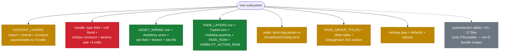
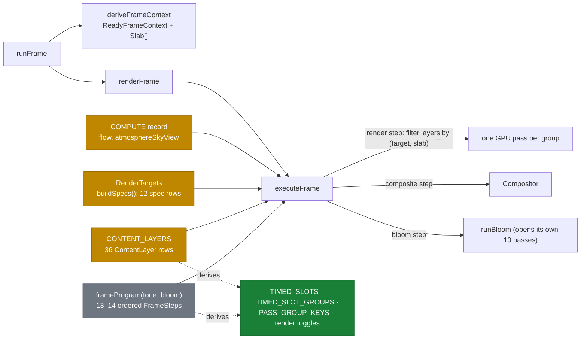
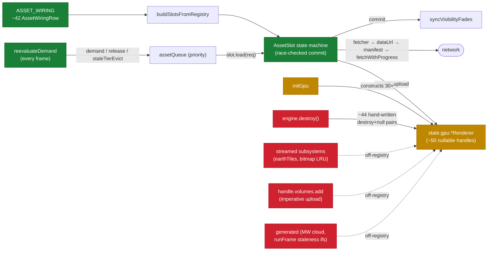
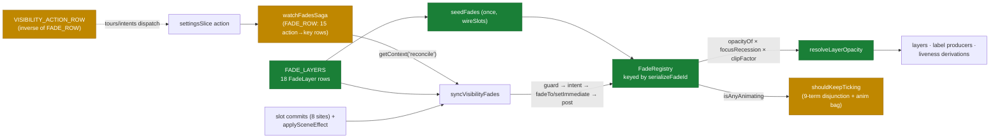
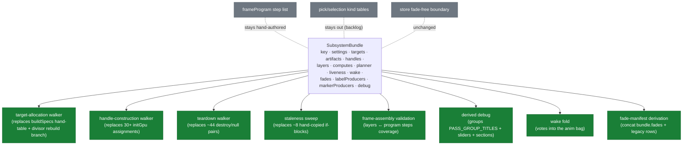

# Current engine composition — contracts and how they compose

Snapshot 2026-08-17, branch `worktree-land-milky-way-refactor` (base `e509f0096`).
[decisions.md](decisions.md) records what we decided; this file records **what
exists today**, with `file:line` evidence. §7 maps each surface onto the
subsystem-bundle spec; §8 lists gaps the spec does not cover.

> **Legend** — 🟢 row-shaped / derived (healthy) · 🟠 hand-maintained (the
> smear) · 🔴 duplicated / off-registry / suspect · ⚪ deliberate / out of
> scope. Diagram fills use the same code.

## 1. Overview — six contract families, one registration diagonal

Each family is internally consistent. The problem: a _subsystem_ is a diagonal
cut across all of them, and most families are registered by hand-editing a
central file rather than contributing a row.

| ⬤   | family           | core contract                                              | registration style                                         |
| --- | ---------------- | ---------------------------------------------------------- | ---------------------------------------------------------- |
| 🟠  | frame assembly   | `ContentLayer`, `FrameStep`, `RenderTargetSpec`, `COMPUTE` | hand-edit: ordinal, spec table, record                     |
| 🟢  | assets           | `AssetWiringRow` → `AssetSlot`                             | row-shaped — but 5 sibling lifecycles live 🔴 off-registry |
| 🔴  | handles/teardown | `EngineGpuHandles` (~50 nullable fields)                   | 4 hand-edits per handle                                    |
| 🟢  | fades/visibility | `FadeLayer` rows + `FadeId`/`VisibilityLayerKey` unions    | row-shaped — plus 🟠 2 hand-kept inverse maps              |
| 🟠  | presentation     | `LabelProducer` · marker path · caption layer              | three mechanisms, one registered                           |
| 🟠  | wake/liveness    | `shouldKeepTicking` disjunction + `anim` bag               | hand-added terms (9)                                       |

⚪ Seventh, parallel surface: **pick/selection** (~10–17 files per focusable
kind) — out of bundle scope →
[focusable-kind backlog](../../backlog/2026-08-17-focusable-kind-registry.md).

What one new subsystem touches today:

## 2. Frame assembly

### The contracts

| contract           | shape                                                                                                                                                                                                                                                                    | where                                                  |
| ------------------ | ------------------------------------------------------------------------------------------------------------------------------------------------------------------------------------------------------------------------------------------------------------------------ | ------------------------------------------------------ |
| `ContentLayer`     | `{name, slab, target, blend, enabled(), draw(), pickEnabled?, drawPick?}` — the `(target, slab)` pin is **data**; executor selects by filter                                                                                                                             | `ContentLayer.d.ts:34`, `executeFrame.ts:185-191`      |
| `FrameStep`        | `compute \| render \| composite \| bloom`; ordered list ⚪ **hand-authored by decision** (#4); 13 steps + optional bloom (zone-of-avoidance added a `render zoa/COSMO` step, merged into `hdr` by a layer, no new `composite`)                                           | `FrameStep.d.ts:43`, `frameProgram.ts:88-165`          |
| `RenderTargetSpec` | `{id, format, depth, scale}`; 12 rows (zone-of-avoidance's `zoa` row landed post-merge, constant `scale: 5` — the plain-`number` half of the union, no new runtime-rebuild case); built by a function (swap format + mw divisor are runtime); `swap` row never allocated | `RenderTargetSpec.d.ts:20`, `renderTargets.ts:220-243` |
| `COMPUTE`          | module-private record, 2 rows; new compute = row + program step                                                                                                                                                                                                          | `executeFrame.ts:82`                                   |

### Loose spots

| ⬤   | issue                                                                                       | evidence                                               |
| --- | ------------------------------------------------------------------------------------------- | ------------------------------------------------------ |
| 🟠  | Clear values live in a **second table** beside the specs; `runBloom` reads it independently | `renderTargets.ts:153-173`, `runBloom.ts:52-68`        |
| 🔴  | `blend` is **advisory** — never checked against the baked pipeline                          | `ContentLayer.d.ts:50-52`                              |
| 🔴  | Target formats **hand-matched** at construction, unenforced                                 | `initGpu.ts:426-428`                                   |
| 🟠  | No check that `layer.target ∈ specs`; no unique-name check (tests only)                     | `frameProgram.test.ts`, `passes.test.ts:376`           |
| ⚪  | Pick targets allocated **outside** `RenderTargets` (documented divergence)                  | `pickProgram.ts:37-106`, `RenderTargetSpec.d.ts:16-17` |
| 🔴  | `mw-aggregate` divisor rebuild is a bespoke branch **inside runFrame**                      | `runFrame.ts:231-245`                                  |

### Cost of one new subsystem (constellations worked example)

- 🟠 **9 file-edits** for the render slice: layer file · 3 edits in `passes/index.ts` (import, load-bearing ordinal, re-export) · handle field · null literal · destroy pair · `initGpu` construct.
- 🟢 **0 edits** for timing slots + debug toggles — derived. This is the model that works.
- 🟠 Own render target? **+4 more**: spec row, clear value, positioned program step, `PASS_GROUP_TITLES` row.

## 3. Asset & handle lifecycles

### The contracts

| contract           | shape                                                                                                                                                                                                                                                                                                                                                                                                                                                                                                                                                                                                                                        | where                                                            |
| ------------------ | -------------------------------------------------------------------------------------------------------------------------------------------------------------------------------------------------------------------------------------------------------------------------------------------------------------------------------------------------------------------------------------------------------------------------------------------------------------------------------------------------------------------------------------------------------------------------------------------------------------------------------------------- | ---------------------------------------------------------------- |
| `AssetWiringRow`   | `{key, factory, req, demand, priority, release?, built?}` — 🟢 the one genuinely registry-shaped lifecycle. The Pluto/Charon landing (#563) reshaped the body-texture rows further onto this pattern: `bodyTextureRow` is now mapped over `ALL_BODY_TEXTURE_KEYS` (itself derived from `BODY_TEXTURE_REGISTRY` + `SCENE_RINGS`), so a new textured body (Pluto, Charon) added zero hand-written rows here — one registry entry, not a new `AssetWiringRow`. Same shift on the consumer side: `assetSlots.bodyTextures` is now one `Map<BodyTextureSlotKey, AssetSlot>` keyed family (`EngineAssetSlots.d.ts:73`), not per-body named fields. | `AssetWiringRow.d.ts:106-139`, `assetWiring.ts:171-311`          |
| `AssetSlot`        | fetch state machine; commit uploads into a renderer + kicks the fade bridge                                                                                                                                                                                                                                                                                                                                                                                                                                                                                                                                                                  | `AssetSlot.ts:65`                                                |
| `EngineGpuHandles` | 🔴 flat struct, ~50 nullable fields (50 counted post-merge — unchanged in kind, though Pluto/Charon's consolidation removed several and zone-of-avoidance added `zoneOfAvoidanceRenderer`/`zoneOfAvoidanceUpsample`, netting out); lifecycle contract = a doc comment                                                                                                                                                                                                                                                                                                                                                                        | `EngineGpuHandles.d.ts:59-604`                                   |
| streamed           | `Destroyable & {plannerParams, update, getTileResources, isAnimating}`; engage rule inside `update()`                                                                                                                                                                                                                                                                                                                                                                                                                                                                                                                                        | `EarthTileSubsystem.d.ts:17-64`, `earthTileSubsystem.ts:246-266` |

### Loose spots

| ⬤   | issue                                                                                                                                                               | evidence                                                                        |
| --- | ------------------------------------------------------------------------------------------------------------------------------------------------------------------- | ------------------------------------------------------------------------------- |
| 🔴  | Registry covers **1 of 5 lifecycles** — generated / streamed / baked / imperative are all bespoke                                                                   | `runFrame.ts:275-281`, `wireSlots.ts:116-119`, `addVolumeField.ts`              |
| 🔴  | Staleness idiom hand-copied **~8×** ("compare live setting vs fact on the resource, destroy + recreate")                                                            | `runFrame.ts:218-219,254-256` self-describe the copy                            |
| 🔴  | Volume ingest exists **3×**; `handle.volumes.add` has 0 callers                                                                                                     | `mcpmSlot.ts:35-46`, `syntheticVolumeSlots.ts:78-99`, `addVolumeField.ts:25-38` |
| 🔴  | Teardown = **~46 hand-written pairs**, ordering encoded only by position (was ~44; zone-of-avoidance added 2: `zoneOfAvoidanceRenderer`, `zoneOfAvoidanceUpsample`) | `engine.ts:747-908`                                                             |
| 🟠  | Swap-format rebuild = a **hand-picked list of 8** renderers                                                                                                         | `buildSwapRenderers.ts:23`                                                      |

### Cost of one new fetched asset (volume field worked example)

- 🟠 **9 file-edits**: source entry · `Source` code · defaults · fetcher · slot file · req type · slot field · wiring row · `AssetKey` union.
- 🟢 **0 edits** in installSlots / slotFor / fadeLayers / initGpu / destroy — where the registry reaches, the long tail is derived.

## 4. Cross-cutting registries — fades, wake, labels, debug

### The contracts

| contract                        | shape                                                                                                                                                                                                                                 | where                                                          |
| ------------------------------- | ------------------------------------------------------------------------------------------------------------------------------------------------------------------------------------------------------------------------------------- | -------------------------------------------------------------- |
| `FadeLayer`                     | 🟢 `{key, expand, handle, seed, intent?, post?, guard?}` — 18 rows, healthy (zone-of-avoidance added a row, fully wired: fade handle + FADE_ROW + VISIBILITY_ACTION_ROW + a live `resolveLayerOpacity` consumer — no gap left behind) | `FadeLayer.d.ts:51-60`, `fadeLayers.ts:97-317`                 |
| `FadeId` / `VisibilityLayerKey` | 12 kinds vs 18 keys — ⚪ deliberately different grain; both type-level unions                                                                                                                                                         | `FadeId.d.ts:80-96`, `VisibilityLayerKey.d.ts:53-71`           |
| wake                            | 🟠 9-term disjunction + explicit `anim` bag fed by planners                                                                                                                                                                           | `shouldKeepTicking.ts:112-129`                                 |
| `LabelProducer`                 | `{id, produceLabels(state, ctx)}` → director (declutter, envelope, change-detect)                                                                                                                                                     | `LabelProducer.d.ts:6-11`, `labelDirectorSubsystem.ts:441-481` |
| debug                           | 🟢 timing slots/groups/toggles **derived** from program + layers                                                                                                                                                                      | `frameProgram.ts:233-384`                                      |

### Loose spots

| ⬤   | issue                                                                                                                                                                               | evidence                                               |
| --- | ----------------------------------------------------------------------------------------------------------------------------------------------------------------------------------- | ------------------------------------------------------ |
| 🟠  | `FADE_ROW` ↔ `VISIBILITY_ACTION_ROW` are **hand-maintained inverses** — a drift pair (zone-of-avoidance added a correctly-mirrored row to both, growing the pair, not narrowing it) | `watchFadesSaga.ts:60-78`, `visibilityActionRow.ts:79` |
| 🔴  | **2 fade rows have no consumer** (union-totality artifacts)                                                                                                                         | `fadeLayers.ts:150-185`                                |
| 🔴  | Marker path is a **shadow producer** — driven from runFrame, unregistered, no wake vote                                                                                             | `runFrame.ts:731-734`                                  |
| 🔴  | Caption layer bypasses the director **and** the fade handles                                                                                                                        | `foregroundLabelsLayer`                                |
| 🟠  | Producers registered inline in engine.ts                                                                                                                                            | `engine.ts:576-587`                                    |
| 🟠  | Wake terms accrete by hand (each = a signature edit)                                                                                                                                | `shouldKeepTicking.ts:19-29`                           |
| 🟠  | Slider tables + DebugPanel sections + `PASS_GROUP_TITLES` hand-listed                                                                                                               | `DebugPanel.tsx:79-90`, `frameProgram.ts:209-224`      |

## 5. Pick / selection (⚪ parallel surface, out of scope)

- `pickProgram` is a deliberate **sibling** of the frame executor: demand-driven, own encoder, own lazily-allocated `r32uint` targets (`pickProgram.ts:92`).
- `frontmostPick` folds **slab-ordered, not depth-ordered** — the slab-partition invariant.
- Layer-side contract (`drawPick`/`pickEnabled`) is clean; the smear is **per kind**: 10–17 dispatch files per focusable kind → [backlog item](../../backlog/2026-08-17-focusable-kind-registry.md). Fresh evidence within range: zone-of-avoidance (#555) touched 13 production files to join the `SelectionRef`/`SelectionRow`/`FocusableTarget` cascade — even though it ends up declared NON-focusable (`focusFraming`'s throw arm), which surfaced a second backlog item, [focusability declared twice on the same discriminant](../../backlog/2026-08-17-focusability-double-encoded.md).

## 6. Assessment — ranked by cost-per-new-subsystem

| #   | ⬤   | breakdown                                                                                               |
| --- | --- | ------------------------------------------------------------------------------------------------------- |
| 1   | 🔴  | **Handle lifecycle** — 4 hand-edits/renderer; 46-pair teardown enforced by a comment                    |
| 2   | 🟠  | **Layer ordinal** — draw order within a group = array position + prose                                  |
| 3   | 🔴  | **Off-registry lifecycles** — generated/streamed/imperative each invent wiring; staleness ×8; ingest ×3 |
| 4   | 🟠  | **Inverse-map drift pairs** — FADE_ROW↔VISIBILITY_ACTION_ROW; specs↔clear values                        |
| 5   | 🟠  | **Hand-listed UI** — DebugPanel JSX, group titles                                                       |
| 6   | 🟠  | **Wake accretion** — every animator edits a signature                                                   |
| 7   | 🔴  | **Unvalidated cross-file contracts** — blend/format parity, target∈specs                                |

🟢 **Do not regress** (already right): the `(target, slab)` data pin ·
`ASSET_WIRING` rows · `FadeLayer` rows + single `seedFades` walk · derived
timing/toggles · table dispatch at each site · store-stays-fade-free · the
hand-authored `frameProgram`.

## 7. What the subsystem-bundle spec changes

One sentence: **make every family look like the two that already work** — one
row-bag per subsystem, walkers derive the central artifacts.

| surface today                                     | bundle field / walker                        | a new subsystem stops touching      |
| ------------------------------------------------- | -------------------------------------------- | ----------------------------------- |
| handle: type + literal + initGpu + destroy        | `handles` + construct/teardown walkers       | all 4 edits                         |
| `CONTENT_LAYERS` import/ordinal/re-export         | `layers` + validation walker                 | the central array                   |
| `ASSET_WIRING` row                                | `artifacts: fetched`                         | nothing — already right             |
| runFrame staleness ifs, MW regen, divisor rebuild | `artifacts: generated{stalenessKey}` + sweep | both `runFrame.ts:211-281` branches |
| ad-hoc streamed construction                      | `artifacts: streamed{engage/disengage}`      | `wireSlots` special cases           |
| `addVolumeField` + ingest ×3                      | folds into `generated`; one ingest fn        | the imperative side-door            |
| spec table + clear values + divisor param         | `targets` (`scale: n \| (state)=>n`)         | the positional param                |
| `COMPUTE` record row                              | `computes`                                   | the record edit                     |
| runFrame CPU planner block                        | `planner` (memoised on ctx)                  | inline planner calls                |
| `deriveXLiveness` conventions                     | `liveness`                                   | nothing — formalized                |
| `anim` bag / disjunction terms                    | `wake` vote fold                             | the signature change                |
| `FADE_LAYERS` row                                 | `fades` (manifest = concatenation)           | the central manifest                |
| inline producer registration                      | `labelProducers` / `markerProducers`         | inline registration + shadow path   |
| group titles + sliders + DebugPanel JSX           | `debug` + derived-debug walker               | the JSX list                        |
| settings slice + defaults                         | `settings` contribution                      | nothing structural                  |

⚪ **Deliberately unchanged**: hand-authored `frameProgram` (#4) · pick kind
tables (backlog) · three named presentation mechanisms (#6) · store fade-free
boundary · engine-core accumulators/gates/ctx (#8).

## 8. Gaps the spec does not cover (addendum candidates)

1. **Clear values onto the target row** — kill the `TARGET_CLEAR_VALUES` drift pair; one source for `runBloom` too.
2. **`FADE_ROW` / `VISIBILITY_ACTION_ROW` derivation** — derive both inverse maps from the bundle's fade declaration, or record why they stay.
3. **Validation depth** — add the acknowledged-unbuilt blend-legality + format-parity checks to the frame-assembly walker.
4. **Swap-format subset** — replace `buildSwapRenderers`' hand list with a `rebuildOnSwapFormat` flag on the handle row.
5. **No-consumer fade rows** — when fades become bundle-declared, decide whether key totality still forces the dead rows.
