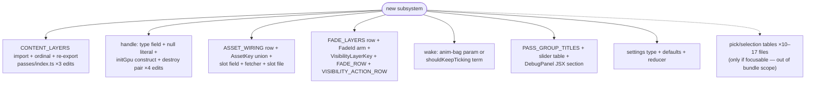
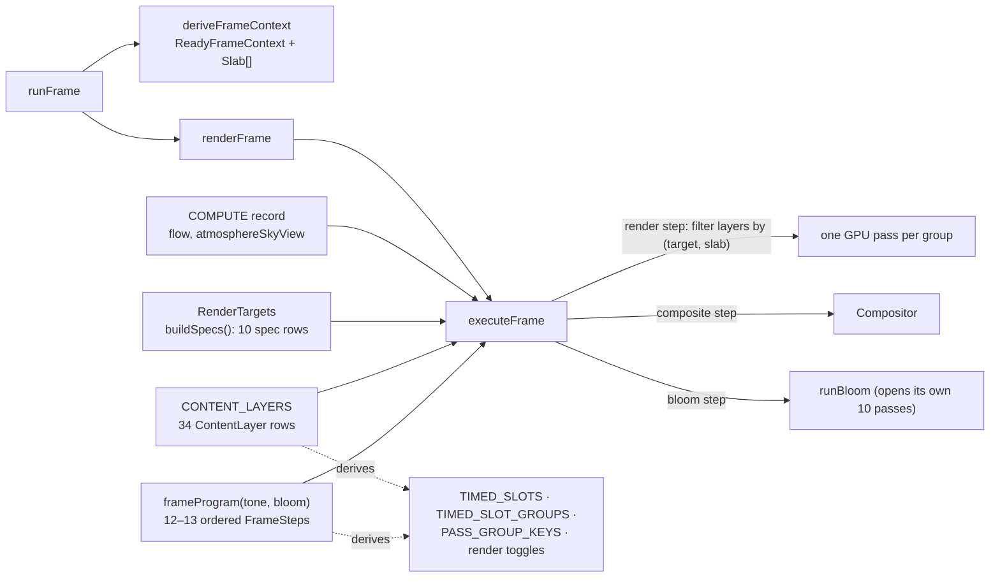
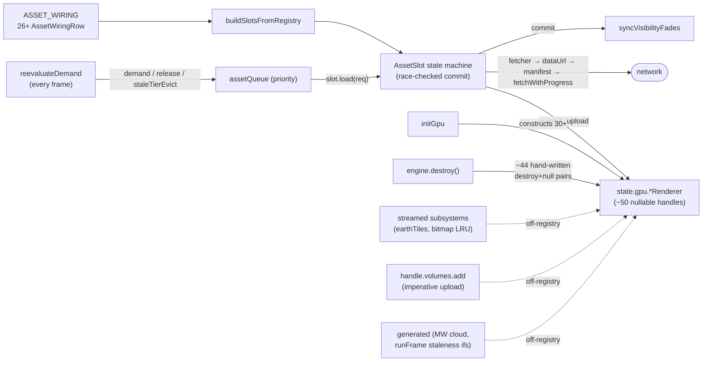
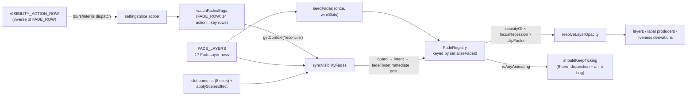
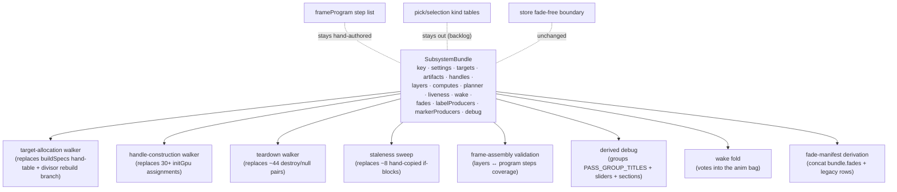

# Current engine composition — contracts and how they compose

Snapshot 2026-08-17, branch `worktree-land-milky-way-refactor` (base `e509f0096`).
Companion to [decisions.md](decisions.md); where that file records what we decided,
this one records **what exists today**: the shape of every composition contract, how
a subsystem plugs into each, and where composition breaks down. Every claim carries
a `file:line` anchor verified against this checkout. §7 maps each surface onto the
subsystem-bundle spec; §8 lists gaps this pass found that the spec does not cover.

## 1. Overview — the contract families and the registration diagonal

The engine has six contract families. Each is internally consistent; the problem is
that a _subsystem_ is a diagonal cut across all of them, and most families are
registered by hand-editing a central file rather than by contributing a row.

| family           | core contract                                              | registration style                                                                           |
| ---------------- | ---------------------------------------------------------- | -------------------------------------------------------------------------------------------- |
| frame assembly   | `ContentLayer`, `FrameStep`, `RenderTargetSpec`, `COMPUTE` | hand-edit: `CONTENT_LAYERS` ordinal, spec table, COMPUTE record                              |
| assets           | `AssetWiringRow` → `AssetSlot`                             | **row-shaped** (the healthiest family) — but 5+ sibling lifecycles live off-registry         |
| handles/teardown | `EngineGpuHandles` (~50 nullable fields)                   | 4 hand-edits per handle (type field, null literal, initGpu construct, destroy pair)          |
| fades/visibility | `FadeLayer` row, `FadeId`/`VisibilityLayerKey` unions      | **row-shaped** — plus two hand-maintained inverse maps (`FADE_ROW`, `VISIBILITY_ACTION_ROW`) |
| presentation     | `LabelProducer`, marker path, caption layer                | three mechanisms; one registered, one driven inline from `runFrame`, one bypasses fades      |
| wake/liveness    | `shouldKeepTicking` disjunction + `anim` bag               | hand-added terms (9 today)                                                                   |

Pick/selection is a seventh, parallel surface (~10–17 dispatch files per focusable
kind) — deliberately out of bundle scope, see
[../../backlog/2026-08-17-focusable-kind-registry.md](../../backlog/2026-08-17-focusable-kind-registry.md).

What one new subsystem touches today (constellations + volumes worked examples,
§2.4/§3.4):

## 2. Frame assembly

### Contracts

- **`ContentLayer`** (`src/@types/engine/frame/ContentLayer.d.ts:34`) — `{name, slab,
target, blend, enabled(), draw(), pickEnabled?(), drawPick?()}`. A layer _declares_
  its `(target, slab)` pin as data; `executeFrame.ts:185-191` selects by filter. This
  is already a good declarative joint.
- **`FrameStep`** (`FrameStep.d.ts:43`) — `compute | render | composite | bloom`.
  The ordered list is hand-authored in `frameProgram.ts:80-153` and stays so by
  decision (order constraints are semantic, not dataflow — decisions.md #4).
- **`RenderTargetSpec`** (`RenderTargetSpec.d.ts:20`) — `{id, format, depth, scale}`;
  table built by `buildSpecs()` (`renderTargets.ts:191`) because swap format and the
  mw divisor are runtime. Ten rows; the `swap` row is spec-only (never allocated).
- **`COMPUTE`** (`executeFrame.ts:82`) — module-private record, two rows; a new
  compute = a row here + a step in `frameProgram.ts`.

### Where it's loose

- **Clear values live beside the table, not on it** — `TARGET_CLEAR_VALUES`
  (`renderTargets.ts:153-173`) is a second id-keyed record that must stay in sync
  with `buildSpecs()`. `runBloom` reads it independently (`runBloom.ts:52-68`).
- **Blend is advisory** — nothing checks `layer.blend` against the baked pipeline
  (acknowledged at `ContentLayer.d.ts:50-52`); target formats are hand-matched at
  construction (acknowledged at `initGpu.ts:426-428`). No runtime check that
  `layer.target ∈ specs`, no unique-name enforcement — tests cover some of this
  (`frameProgram.test.ts`, `passes.test.ts:376`), the type system covers none.
- **Pick targets live outside `RenderTargets`** — `pick:cosmo`/`pick:near0`
  allocated lazily inside `pickProgram.ts:37-106`, a documented divergence
  (`RenderTargetSpec.d.ts:16-17` lists them as intended rows).
- **One target rebuild is a bespoke frame branch** — the `mw-aggregate` divisor
  drift check destroys and recreates the whole `RenderTargets` object inside
  `runFrame.ts:231-245`, with the divisor threaded as a positional parameter of
  `createRenderTargets`.

### Registration cost (constellations, this slice only)

9 file-edits: the layer file itself, 3 edits in `passes/index.ts` (import, ordinal
position — load-bearing for non-commutative blends — and re-export), a handle field
plus null literal plus destroy pair, and the `initGpu` construction with
hand-matched target format. Zero edits for timing slots and debug toggles (derived)
— the model that works. A subsystem needing its _own_ target additionally edits the
spec table, `TARGET_CLEAR_VALUES`, `frameProgram` (a correctly-positioned step), and
`PASS_GROUP_TITLES`.

## 3. Asset & handle lifecycles

### Contracts

- **`AssetWiringRow`** (`AssetWiringRow.d.ts:106-139`) — `{key, factory, req, demand,
priority, release?, built?}`. The one genuinely registry-shaped lifecycle: a
  fetched asset is one row + one slot file + one fetcher, and `installSlots`/
  `slotFor`/load-progress/demand all derive (`assetWiring.ts:261-444`).
- **`AssetSlot`** (`AssetSlot.ts:65`) — the state machine with commit serialization;
  commits upload into a renderer handle and kick the fade bridge.
- **`EngineGpuHandles`** (`EngineGpuHandles.d.ts:88-626`) — a flat hand-written
  struct of ~50 nullable fields whose lifecycle contract is a doc comment: "when
  adding a renderer, add it here so the teardown path stays complete."
- **Streamed** (`EarthTileSubsystem.d.ts:17-64`) — `Destroyable & {plannerParams,
update, getTileResources, getUploadedWindow, isAnimating}`; the engage/stand-down
  rule lives _inside_ `update()` (`earthTileSubsystem.ts:246-266`), the substrate
  (`bitmapStreamSubsystem`) shared by the galaxy atlas and hi-res famous.

### Where it's loose

- **The registry covers one of five lifecycles.** Fetched rows are declarative;
  _generated_ (MW cloud regen at `runFrame.ts:275-281`, target rebuild at `:231-245`),
  _streamed_ (constructed ad hoc in `wireSlots.ts:116-119`), _baked_ (unconditional
  construction), and _imperative_ (`addVolumeField`) each have bespoke wiring.
- **Staleness is a hand-copied pattern, ~8 sites.** All follow "compare the live
  setting against a fact read off the resource, destroy + recreate" (`runFrame.ts`
  ×2 — self-described as "the same shape asked about a different input" at
  `:218-219,254-256` — `rebuildHiResFamousForTier`, `staleTierEvict`,
  `applySwapFormat`, earth page-table rebuild, tier reload sweep).
- **Volume ingest exists three times.** `mcpmSlot.ts:35-46`,
  `syntheticVolumeSlots.ts:78-99`, and `addVolumeField.ts:25-38` are parallel copies
  of "upload cube + seed settings row + kick volumeField fade" — and
  `handle.volumes.add` has zero in-repo callers.
- **Teardown is ~44 hand-written pairs** (`engine.ts:842-933`) with ordering
  constraints (impostor chain, `focusUniform` last) encoded only by position.
- **Handle construction is 30+ sequential assignments** in `initGpu.ts`, with a
  hand-picked 8-renderer subset rebuilt on swap-format change
  (`buildSwapRenderers.ts:23`).

### Registration cost (a new fetched volume field)

9 file-edits (source entry, `Source` code + registry, field defaults, fetcher, slot
file, req type, `EngineAssetSlots` field, wiring row, `AssetKey` union) — but
notably **zero** edits in installSlots/slotFor/fadeLayers/initGpu/destroy: where the
registry reaches, the long tail is already derived.

## 4. Cross-cutting registries — fades, wake, labels, debug

### Contracts

- **`FadeLayer`** (`FadeLayer.d.ts:51-60`) — `{key, expand, handle, seed, intent?,
post?, guard?}`; 17 rows in `fadeLayers.ts:97-308`. Row-shaped and healthy; the
  `handle()` translation is the sole `VisibilityLayerKey → FadeId` crossing point.
- **`FadeId`** (11 kinds) vs **`VisibilityLayerKey`** (17 keys) — deliberately
  different grain; both type-level unions, so a new fade is also two union arms.
- **Wake** (`shouldKeepTicking.ts:112-129`) — a 9-term disjunction plus an explicit
  `anim` parameter bag (`starFadeAnimating`, `earthTilesAnimating`) fed by planners
  inside `runFrame`; label director and fade sync wake the scheduler independently.
- **Labels** — `LabelProducer` (`LabelProducer.d.ts:6-11`) collected by the
  director with declutter/envelope/change-detection; three producers registered
  inline at `engine.ts:576-587`.
- **Debug** — `TIMED_SLOTS`/groups/toggles all _derived_ from the program + layers
  (`frameProgram.ts:233-384`); `PASS_GROUP_TITLES` (11 hand rows, graceful
  fallback), per-subsystem slider tables (`milkyWaySliderFields.ts:27`,
  `flowFields.ts:34` with a `surface` discriminant), hand-listed DebugPanel
  sections (`DebugPanel.tsx:79-90`).

### Where it's loose

- **`FADE_ROW` and `VISIBILITY_ACTION_ROW` are hand-maintained inverses** of each
  other (`watchFadesSaga.ts:59-77`, `visibilityActionRow.ts:78`) — a drift pair on
  top of the already-declarative `FADE_LAYERS`.
- **Two fade rows have no consumer** (`starCatalogLabel`, `bodyLabel`,
  `fadeLayers.ts:150-185`) — they exist only because `VisibilityLayerKey` totality
  and `LAYER_GROUPS` need the keys; the caption layer reads `labelEnabled` directly.
- **The marker path is a shadow producer** — `produceStructureMarkers` is driven
  straight from `runFrame.ts:731-734`, not registered, no `awake` vote, no
  declutter; the caption layer (`foregroundLabelsLayer`) is a third mechanism that
  bypasses fade handles entirely.
- **Wake terms accrete by hand** — the `anim` bag is honest about this by design
  ("new in-frame animators extend the bag"), but each term is a signature change.

## 5. Pick / selection (parallel surface, out of bundle scope)

`pickProgram` (`pickProgram.ts:92`) is a deliberate _sibling_ of the frame executor
sharing only the `ContentLayer` registry: demand-driven, own encoder, own lazily
allocated `r32uint` targets, `frontmostPick` folding **slab-ordered, not
depth-ordered**. The layer-side contract (`drawPick`/`pickEnabled`) is clean; the
smear is per-_kind_: adding a focusable kind touches 10–17 dispatch files
(`FocusableTarget` union → `RESOLVE_PICK` → `EXTRACT_ROW` → `BUILD_FOCUSABLE` →
`SELECTION_HALO_TABLE` → `focusFraming` switch → URL codec ×3 → `DETAIL_CARD` →
palette ×2 → identity/recession rows). Inventoried in the
[focusable-kind-registry backlog item](../../backlog/2026-08-17-focusable-kind-registry.md);
the bundle contract deliberately excludes it because kinds don't map 1:1 onto
render subsystems.

## 6. Assessment — where composition actually breaks down

Ranked by cost-per-new-subsystem, with the evidence above:

1. **Handle lifecycle (worst)** — 4 hand-edits per renderer across type/literal/
   init/destroy; a ~44-pair teardown list whose completeness is enforced by a
   comment. No registry, no walker.
2. **Layer registration ordinal** — `CONTENT_LAYERS` position encodes draw order
   within a `(target, slab)` group; correctness is a prose block + migration tests.
3. **Off-registry lifecycles** — generated/streamed/imperative assets each invent
   wiring; staleness logic is the same idiom copied ~8×; volume ingest ×3.
4. **Inverse-map drift pairs** — `FADE_ROW` ↔ `VISIBILITY_ACTION_ROW`; spec-table ↔
   `TARGET_CLEAR_VALUES`; `FadeId` ↔ `VisibilityLayerKey` (intentional grain
   difference, but three unions/maps move together on every fade addition).
5. **Hand-listed UI surfaces** — DebugPanel section JSX, `PASS_GROUP_TITLES`,
   slider tables (though the tables themselves are good local contracts).
6. **Wake accretion** — each new animator is a signature or disjunction edit.
7. **Unvalidated cross-file contracts** — blend/format parity, `target ∈ specs`,
   name uniqueness: tests catch some, nothing structural.

What is already _right_ and must not be regressed: the `(target, slab)` data pin on
layers; the demand-driven `ASSET_WIRING` row; the `FadeLayer` row + single
`seedFades` walk; derived timing/toggles; table dispatch as the house idiom at each
individual site; the store-stays-fade-free boundary; the explicit hand-authored
`frameProgram` step list.

## 7. What the subsystem-bundle spec changes

The bundle contract is precisely "make every family look like the two that already
work" (ASSET_WIRING, FADE_LAYERS): one row-bag per subsystem, walkers derive the
central artifacts.

| surface today                                                 | bundle field / walker                                                        | what a new subsystem stops touching                                 |
| ------------------------------------------------------------- | ---------------------------------------------------------------------------- | ------------------------------------------------------------------- |
| `EngineGpuHandles` field + literal + `initGpu` + destroy pair | `handles` factory + construction/teardown walkers                            | all four edits collapse to one factory entry                        |
| `CONTENT_LAYERS` import/ordinal/re-export                     | `layers` + frame-assembly validation walker                                  | the central array; ordinal-within-group remains explicit per bundle |
| `ASSET_WIRING` row (fetched)                                  | `artifacts: fetched`                                                         | unchanged — it was already right                                    |
| `runFrame` staleness ifs, MW regen, divisor rebuild           | `artifacts: generated{stalenessKey, regenerate}` + sweep                     | both `runFrame.ts:211-281` branches deleted                         |
| ad-hoc streamed construction                                  | `artifacts: streamed{engage/disengage}`                                      | `wireSlots` special cases                                           |
| `addVolumeField` + 3× ingest copies                           | folds into `generated`; one ingest fn (volumes prover)                       | the imperative side-door                                            |
| spec table + `TARGET_CLEAR_VALUES` + divisor param            | `targets: RenderTargetContribution` (`scale: n \| (state)=>n`)               | the positional `mwAggregateDivisor` param                           |
| `COMPUTE` record row                                          | `computes`                                                                   | the record edit                                                     |
| `runFrame` CPU planner block                                  | `planner` (memoised on ctx)                                                  | inline planner calls                                                |
| `deriveXLiveness` conventions                                 | `liveness` (both incumbent forms, first-class)                               | nothing — formalized, not moved                                     |
| `anim` bag / disjunction terms                                | `wake` vote folded by walker                                                 | the signature change                                                |
| `FADE_LAYERS` row                                             | `fades` rows, manifest = concatenation                                       | the central manifest edit                                           |
| inline producer registration (`engine.ts:576-587`)            | `labelProducers` / `markerProducers` (markers grown from the producer shape) | inline registration + the shadow marker path                        |
| `PASS_GROUP_TITLES`, slider tables, DebugPanel JSX            | `debug{groupTitle, sliders}` + derived-debug walker                          | the JSX section list                                                |
| settings slice + defaults                                     | `settings` contribution                                                      | nothing structural (slices stay slices)                             |

Explicitly **not** changed by the spec: the hand-authored `frameProgram` (decision
#4), pick/selection kind tables (backlog), the three presentation mechanisms as
_named_ mechanisms (decision #6), the store fade-free boundary, engine-core-owned
accumulators/gates/ctx (decision #8).

## 8. Gaps this pass found that the spec does not currently cover

Candidates for spec addenda (verified absent from
`2026-08-17-subsystem-bundles-design.md` by search):

1. **Clear values should ride the target contribution.** `TARGET_CLEAR_VALUES` is a
   second id-keyed table today; `RenderTargetContribution` should carry
   `clearValue` so the pair can't drift and `runBloom` reads one source.
2. **`FADE_ROW` / `VISIBILITY_ACTION_ROW` derivation.** The spec derives the
   `FADE_LAYERS` manifest but leaves both inverse action-maps hand-maintained. A
   bundle's fade row already knows its settings actions in `seed`/`intent`; worth
   deciding whether the pair derives from the same declaration or stays (and if it
   stays, saying why).
3. **Frame-assembly validation depth.** The planned walker validates layer↔step
   coverage; the blend-legality and target-format parity checks acknowledged as
   unbuilt (`ContentLayer.d.ts:50-52`, `initGpu.ts:426-428`) are cheap to add to
   the same walker and close a real landmine class.
4. **Swap-format-dependent handle subset.** `buildSwapRenderers`' hand-picked list
   of 8 is another hand-maintained membership; a `rebuildOnSwapFormat` flag on the
   handle declaration would fold it into the construction walker.
5. **No-consumer fade rows** (`starCatalogLabel`, `bodyLabel`) — union-totality
   artifacts; when fades become bundle-declared, decide whether key totality is
   still required or per-bundle keys can drop the dead rows.
