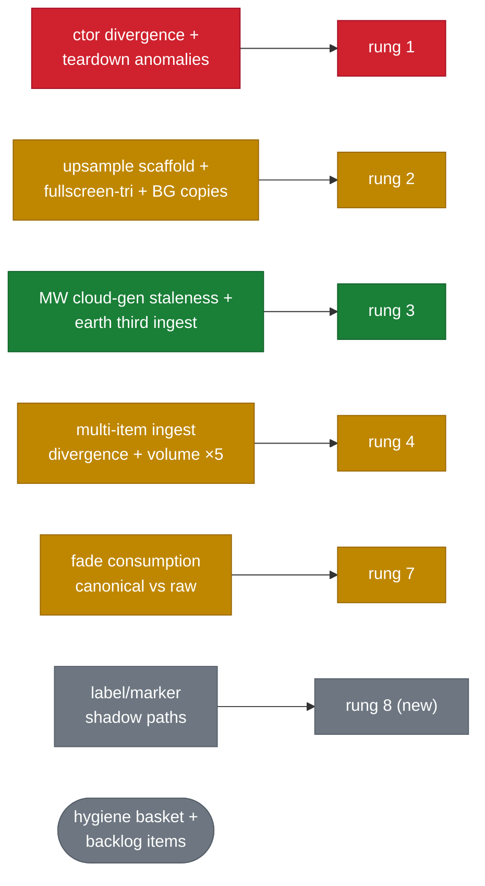

# Renderer & layer outliers — consolidation map

Snapshot 2026-08-17, from three exhaustive sweeps (41 `state.gpu` renderers
post-merge, up from 39: zone-of-avoidance (#555) added
`zoneOfAvoidanceRenderer` and `zoneOfAvoidanceUpsample`; all 36
`ContentLayer`s, up from 34 the same way, cross-cutting mechanism mining). Companion to
[current-contracts-map.md](current-contracts-map.md); this file ranks the odd
ones out and assigns each to a ladder rung per decisions.md #9/#10. Rule #10
applied throughout: an outlier is either evidence the family's row shape must
change for everyone, or an underlying-contract refactor that lands **before**
its family's rung so the row fits without a per-row exception.

> **Legend** — 🟢 row-shaped / derived (healthy) · 🟠 hand-maintained (the
> smear) · 🔴 duplicated / off-registry / suspect · ⚪ deliberate / out of
> scope. Diagram fills use the same code. §6's ⬤ column carries a locally
> scoped reading — see the note above that table.

## 1. Renderer families and their outliers

Four constructor families exist; the outliers are misfits per #10, not styles.
The ⬤ column rates how divergent the family is as a whole (outlier cells keep
their original misfit descriptions verbatim):

| ⬤   | family                                                                                  | norm (members)                                                                                                     | outliers                                                                                                                                                                                                                                                                                                                                                                                                                     |
| --- | --------------------------------------------------------------------------------------- | ------------------------------------------------------------------------------------------------------------------ | ---------------------------------------------------------------------------------------------------------------------------------------------------------------------------------------------------------------------------------------------------------------------------------------------------------------------------------------------------------------------------------------------------------------------------- |
| 🟠  | A. point-cloud/overlay `(device, targetFormat[, fadeBgl])` positional                   | filament, constellation, volumeField, starPoint, bodyGlint, starCatalog, orbitTrail, the 4 upsamples, bloomPyramid | `pointRenderer` (options-object + 3 BGLs + injectable buildRunner; handle named bare `renderer`); `flowField`/`horizonShell`/`milkyWayCloudRenderer` (object-init); `milkyWayCloudRenderer` (bespoke type, `drawStars`/`drawDust` instead of `draw`, the repo's only `layout:'auto'`)                                                                                                                                        |
| 🔴  | B. swap-format overlays `(ctx: GpuContext, format, …)`, rebuilt by `buildSwapRenderers` | label, foregroundLabel, markerLine, foregroundMarkerLine, debugLine, selectionRing                                 | `structureMarker` (ctx-shaped but rgba16float + not swap-coupled); `milkyWayPick` (ctx-shaped, no format param); `pickDebugOverlay`/`diskRadiusRing` (in the swap list but bare `(device, format)`); ~~`compositor` takes `swapFormat` at construction but is NOT rebuilt on swap change`~~ — **RESOLVED NEGATIVE, see §5**: `createCompositor` now takes only `{ device }`, verified against current `compositor.ts` source |
| 🟠  | C. foreground bodies `(device, format, depthFormat, reversedZ)`                         | star, planet, earth, texturedBody, ring, cloudShell                                                                | `atmosphereShell` (5th param table + compute entry point); `bodyPick` (formats hard-coded, 2 params); `earth` (third non-slot ingest: `setTileResources` from runFrame)                                                                                                                                                                                                                                                      |
| 🔴  | D. multi-item `upload(id, x)` / `unload(id)`                                            | pointRenderer, volumeFieldRenderer                                                                                 | `starCatalogRenderer` (`upload` **no `unload`** — eviction path absent); `texturedBodyRenderer` (`setMap`/`clearMap` verbs, id repeated in `draw`); `atmosphereShell` (item set baked at construction)                                                                                                                                                                                                                       |

**Construction-order dependencies** (rung 1's risk register):

| ⬤   | dependency                                                                  | evidence                                                                           |
| --- | --------------------------------------------------------------------------- | ---------------------------------------------------------------------------------- |
| 🟢  | five engine-core prerequisites — everything hangs off these                 | `fadeBgl`, `sourceBgl`, `focusBgl`, `focusUniform`, `uiCtx`+`fontAtlases`          |
| 🟠  | exactly one renderer→renderer edge                                          | `starCatalogPickRenderer ← starCatalogRenderer.pickResources()` (`initGpu.ts:499`) |
| 🟠  | two post-construction attachments; the second re-runs on every swap rebuild | `biasCorrection.attachRenderer`, `labelDirector.attachRenderers`                   |

**Teardown anomalies** (rung 1 inputs):

| ⬤   | anomaly                                                                               | evidence |
| --- | ------------------------------------------------------------------------------------- | -------- |
| 🔴  | `fadeBgl`/`sourceBgl`/`focusBgl` never destroyed or nulled                            | —        |
| 🟠  | `timingService` is the only handle re-assigned (to a disabled stub) instead of nulled | —        |
| 🔴  | the 8 swap renderers have a **second** teardown site inside `buildSwapRenderers`      | —        |
| 🟠  | 6 handles lack the `label` field the `Renderer` type family carries                   | —        |

## 2. Layer norms and their outliers

Norms (majority behaviour): pure `enabled()` gate; `draw()` records only;
uploads happen in runFrame planners or slot commits; shared liveness derivation
where ≥2 layers share a gate.

**`enabled()` purity violations**

| ⬤   | finding                                                                                               | evidence   |
| --- | ----------------------------------------------------------------------------------------------------- | ---------- |
| 🔴  | `fieldStarSphereLayer` runs the nearest-star query in `enabled()` and stores it for `draw`/`drawPick` | `:217-238` |

**Uploads inside `draw`**

| ⬤   | layer            | note                                                                                                       |
| --- | ---------------- | ---------------------------------------------------------------------------------------------------------- |
| 🟠  | starPoints       | `setStars` per frame, justified by rebasing header                                                         |
| 🟠  | foregroundLabels | `setLabels` + `setLines`                                                                                   |
| 🟠  | clipPathDebug    | `setLines`                                                                                                 |
| 🟠  | starCatalog      | `prepareStarCut` mutates fade state + streams — memoised per ctx, pick path deliberately re-advances ramps |

**God-layers** (median layer ≈ 100 LoC)

| ⬤   | finding                                                                                                                                                             | evidence |
| --- | ------------------------------------------------------------------------------------------------------------------------------------------------------------------- | -------- |
| 🔴  | `starCatalogLayer` 983 LoC — owns `starCatalogVisible`, `prepareStarCut`, stream SoA; two sibling layers import their `enabled` from it (a layer importing a layer) | —        |

**Copied gates**

| ⬤   | finding                                                                     | evidence                                                      |
| --- | --------------------------------------------------------------------------- | ------------------------------------------------------------- |
| 🟠  | `foreground:0` triple (handle ∧ `FOREGROUND_MAX` ∧ non-empty) hand-repeated | ~8 layers — confirms decisions.md #7's step-level-gate ruling |
| 🟠  | sub-pixel cull recomputed                                                   | ×3                                                            |
| 🟠  | origin-distance `Math.hypot(ctx.drawCamPos…)` inline                        | ≥10 layers                                                    |

**Pick divergences** (all deliberate, now inventoried)

| ⬤   | finding                                               | evidence                      |
| --- | ----------------------------------------------------- | ----------------------------- |
| ⚪  | milkyWay narrower                                     | min-distance floor            |
| ⚪  | planets/bodyGlints/starPoints wider                   | caption stamps, flat∪textured |
| ⚪  | pointSprites re-implements its gate inside `drawPick` | —                             |
| ⚪  | texturedBodies delegates pick to a sibling row        | —                             |

## 3. Fade consumption — the canonical path lost

| ⬤   | path                                                                           | count | examples                                                                                                                                                                                                                                                                                                                                                                                                                                                                                                                                                                                                                                                                                   |
| --- | ------------------------------------------------------------------------------ | ----- | ------------------------------------------------------------------------------------------------------------------------------------------------------------------------------------------------------------------------------------------------------------------------------------------------------------------------------------------------------------------------------------------------------------------------------------------------------------------------------------------------------------------------------------------------------------------------------------------------------------------------------------------------------------------------------------------ |
| 🟢  | canonical `resolveLayerOpacity` (opacity × recession × clip)                   | 4     | filaments, orbitTrails, volumeLiveness, zoneOfAvoidanceLiveness (NEW, #555 — follows the canonical path cleanly: `zoneOfAvoidanceLayerOpacity.ts` takes the already-resolved opacity as a parameter and multiplies in its own approach/recede distance bands, rather than re-deriving a raw copy)                                                                                                                                                                                                                                                                                                                                                                                          |
| 🔴  | raw `fades.opacityOf` — bypasses `resolveLayerOpacity` (partitioned by #18 D8) | 21    | **Corrected 2026-08-20 (rung 7, #18 D1/D8): 21 raw production sites under `src/`, not 5, and "skips recession **and** clip" is false on both halves** — the five per-instance producers reach clip by a fourth path (hoisted `clipOpacityOf` literals), and the nine gate sites exclude both factors by ruling rather than miss them. Recession is provably `1` only at the seven sites #18 D8 migrates; six other raw sites read receding ids and compose recession by hand (#18 D10). D8 partitions all 21 — 7 migrate, 9 stay raw (pass-runs / residency / fade-out-tail / pick gates, where clip or recession would unload or unclick a merely-dimmed layer), 5 per-instance producers |
| 🔴  | registered handles with no consumer                                            | 3     | **Corrected 2026-08-20 (rung 7, #18): proceduralDisks, texturedDisks, `scaleBar`.** `structureRing` was listed here in error — it has two live readers (`produceStructureMarkers.ts:75`, `produceStructureLabels.ts:120`) plus a clip channel at `:65` — and `scaleBar` was omitted. Ruled: the three registration-only rows stay (#18 D13). `starCatalogLabel` and `bodyLabel` **left this count in rung 8** (decisions.md #19): `produceSceneBodyCaptions.ts` now composes both handles' `fades.opacityOf` into the caption target, so `fade(['starCatalogLabel'\|'bodyLabel'], …)` reaches pixels (#18 D12's wire, discharged)                                                          |
| 🟠  | no fade handle where one plausibly applies                                     | ~12   | horizon shell, both selection rings, rings, cloud/atmosphere shells, bodies — unchanged post-merge (zoneOfAvoidance shipped WITH a handle, unlike this pattern)                                                                                                                                                                                                                                                                                                                                                                                                                                                                                                                            |

## 4. Recurring mechanisms (the patterns)

1. 🟢 **RESOLVED — rung 2** (`createUpsampleLayer.ts`, PR #575). The four
   producer layers now share one primitive with a `postBlit` hook —
   `zoneOfAvoidanceUpsampleLayer.ts` uses it for its MSDF caption draw — and
   the downscaled-viewport formula lives once in `reducedTargetSize.ts`,
   called from `renderTargets.ts:334` (verified zero remaining inline
   copies). Original finding, for record: **Reduced-res accumulate →
   upsample, ×4 — copy-paste confirmed, and
   still growing.** `zoneOfAvoidanceUpsampleLayer` (#555,
   `passes/zoneOfAvoidanceUpsampleLayer.ts`) is a 4th instance of the exact
   scaffold: `enabled` is `deriveXLiveness(...) !== null`, `draw` is a
   defensive null-check + one blit call. The downscaled-viewport derivation
   (`Math.max(1, Math.floor(ctx.canvasSize.width / scale))` etc.) is now a
   verbatim QUADRUPLICATE across the 4 producer layers —
   `scalarVolumeLayer.ts:62-63`, `starAggregatesLayer.ts:60-61`,
   `milkyWayAggregateLayer.ts:69-70`, `zoneOfAvoidanceLayer.ts:43-44` — each
   with its own copy of the rationale comment. `zoneOfAvoidanceUpsampleLayer`
   also reuses the shared `createAdditiveUpsample` factory directly (no new
   pipeline), so it is genuine evidence FOR the shared primitive, not a
   divergent one — except its `draw` bolts on a second concern the scaffold
   doesn't have: after the blit, it also draws the band's full-res MSDF
   lettering (`drawLabels`) through the same liveness gate. A shared
   `{name, slab, sourceTargetId, handleKey, enabled}` primitive would need an
   optional post-blit hook to fit this 4th row without a bolted branch (rule
   #10) — worth deciding at rung 2 rather than after, since it would collapse
   the ~10 hand-edit sites per instance.
2. 🔴 **Fullscreen triangle, ×5 + a second implementation.** Byte-identical
   vertex bodies in additiveUpsample/starAggregateUpsample/compositor/bloom,
   plus `lib/fullscreenTri.wesl` implementing the same primitive differently;
   `VSOut` duplicated ×5. `additiveUpsample` now serves THREE instances
   (`volumeUpsample`, `milkyWayAggregateUpsample`, and — new, #555 —
   `zoneOfAvoidanceUpsample`, `initGpu.ts:401`), all through the one shared
   pipeline — no 4th vertex-shader copy landed. `bloom/io.wesl`'s header
   claiming the shared one "is the tool's" is stale.
3. 🟠 **Composite vs upsample — two mechanisms for one job.** The compositor
   already models additive-into-hdr and its header claims this unification,
   but the upsamples can't ride it: the nearest-sampler assumption and the
   documented single-uniform-buffer race (`compositor.ts:44-53`) are both
   named, fixable blockers if unification is ever wanted.
4. 🟠 **Grow-on-demand instance buffer, ×7+ copies.**
   `instancedQuadRenderer`'s parameterized `capacity` config already exists;
   the copies vary by stride, label, usage, count unit, and overflow policy.
   Classic extract-one-helper.
5. Uniform packing:
   - 🟢 `writeCameraPrefix` — the success story, 16 consumers.
   - 🔴 The 16-byte fade scratch is duplicated ×4 (one comment admits "same
     shape as filamentRenderer's"); `structureMarkerRenderer` re-declares the
     dummy-fade pair the shared `createDummyFadeBindGroup` already provides.
6. Compute→renderer:
   - 🟢 The `COMPUTE` record is a working primitive — 2 rows, uniform shape,
     gates inside the encoder.
   - 🟠 MW v1 cloud generation is the odd one out: own encoder/submit plus the
     hand staleness `if` (rung 3's canonical case); v2 placement is not wired
     in `src` at all (tool-only — Track B territory, as expected).
     **PARTIALLY RESOLVED — rung 3** (PR #579): the hand staleness `if`
     moved out of `runFrame.ts` into `MilkyWayCloud.reconcile`
     (`runFrame.ts:214`, one declarative call) — it is resource-owned now,
     not deleted. The own-encoder/submit divergence (`milkyWayCloud.ts:75-77`)
     is unchanged; still the compute→renderer family's one outlier.
7. 🔴 **Streaming/LRU.** The substrate is shared, but `hiResFamousSubsystem`
   bypassed it and re-implements in-flight/failure/evict bookkeeping (its own
   header admits this); there are two LRU implementations differing only in
   victim policy.
8. 🟠 **Per-draw bind-group rebuild** (resize safety). 5 copies of the same
   comment plus code — genuinely fine as an idiom, but the copies would
   collapse into the upsample scaffold from item 1.

## 5. Bug-suspects surfaced (verify before or during the relevant rung)

| ⬤   | suspect                                                                                                                                           | evidence                                                                                                                                                                                                                                                                                                                                                                                                                                                                                              | cheap check                                                                                                                                                                                                                                                                                                                                                                                                                                                                                      |
| --- | ------------------------------------------------------------------------------------------------------------------------------------------------- | ----------------------------------------------------------------------------------------------------------------------------------------------------------------------------------------------------------------------------------------------------------------------------------------------------------------------------------------------------------------------------------------------------------------------------------------------------------------------------------------------------- | ------------------------------------------------------------------------------------------------------------------------------------------------------------------------------------------------------------------------------------------------------------------------------------------------------------------------------------------------------------------------------------------------------------------------------------------------------------------------------------------------ |
| 🟢  | `compositor` not rebuilt on swap-format change — **RESOLVED NEGATIVE** (decisions.md #11, verified during rung 1's Task 12 smoke pass), not a bug | `createCompositor` now takes only `{ device }` — no `swapFormat`/`hdrFormat` param at all; pipelines cache per-draw on the live `(blend, dstFormat)` key (`compositor.ts:232-273`), so there is no baked format that could go stale. Re-verified against current source for this sweep.                                                                                                                                                                                                               | not a diff — a verified result, confirmed by a clean HDR-toggle visual smoke                                                                                                                                                                                                                                                                                                                                                                                                                     |
| 🟢  | `fieldStarSphereLayer` has no `FOREGROUND_MAX` gate — **RESOLVED NEGATIVE** (rung 6, #16 D6), not a bug                                           | the layer self-gates on camera **POSITION** instead: `enabled()` requires a catalogued Gaia star within the resolve-radius hysteresis band of `ctx.drawCamPos`, measured **~1.45 AU** (7.04e-12 Mpc) — roughly **10.5 orders of magnitude** tighter than the 0.23 Mpc `FOREGROUND_MAX_DISTANCE_MPC` cut. A runtime probe against the real octree + catalog confirmed `enabled()` is already `false` at cosmic zoom (camera 0.5 Mpc from the Sun)                                                      | not a diff — a verified result: the one pose where the missing gate would matter (camera within ~1.5 AU of a star while `cam.distance` ≥ 0.23 Mpc) is unreachable by any tween or resting base, and were it reachable, today's behaviour (a sphere for the star the camera is parked at) is correct anyway. Residual cited, not fixed, at [`docs/backlog/2026-07-30-camera-target-vs-origin-distance-gates.md`](../../backlog/2026-07-30-camera-target-vs-origin-distance-gates.md) (unmodified) |
| 🟢  | dead ingest surfaces — **checked (rung 4), not a bug**                                                                                            | `handle.volumes.add` is **discharged**: it now executes the same `uploadVolumeField` the four volume slot commits do, so it is an entry point, not a parallel path (#14 D3). The other two stay, deliberately: `PointRenderer.unload` (`catalogStore.unload`) has test-only callers and `FilamentRenderer.clear` has no `src/` caller outside its own module, but deleting either would mint an upload-without-unload outlier — the very shape #11 asks the ladder to normalize away from (#14 D3/D6) | done — repo-wide grep, 2026-08-19                                                                                                                                                                                                                                                                                                                                                                                                                                                                |
| 🔴  | stale shader-tree docs                                                                                                                            | `bloom/io.wesl` header claiming the shared fullscreen-tri "is the tool's"; `additiveUpsample.ts` "two subsystems" comment                                                                                                                                                                                                                                                                                                                                                                             | diff the comment's claim against current imports                                                                                                                                                                                                                                                                                                                                                                                                                                                 |

## 6. Ladder assignments

_The ⬤ column below is scoped to this table only: 🔴 = must land before/with
the rung per decision #10 · 🟠 = widens the rung's scope · 🟢 = hygiene/backlog,
non-blocking. ⚪ marks a finding explicitly deferred out of the current track._

| ⬤   | finding                                                                                                                                                                                                                                                   | #10 classification                                                                                                                                                                                                | lands in                                                                                                                                                                                                                                                                                                                                                                                                                                                                                                                                                                                                                                                                                                                                                                 |
| --- | --------------------------------------------------------------------------------------------------------------------------------------------------------------------------------------------------------------------------------------------------------- | ----------------------------------------------------------------------------------------------------------------------------------------------------------------------------------------------------------------- | ------------------------------------------------------------------------------------------------------------------------------------------------------------------------------------------------------------------------------------------------------------------------------------------------------------------------------------------------------------------------------------------------------------------------------------------------------------------------------------------------------------------------------------------------------------------------------------------------------------------------------------------------------------------------------------------------------------------------------------------------------------------------ |
| 🔴  | Constructor family divergence (§1 A–C) + teardown anomalies + order edges                                                                                                                                                                                 | underlying-contract normalization feeding the row shape: uniform `construct(deps)`, shared prerequisites stay engine-core                                                                                         | **rung 1 — shipped (#571), but only the construct/teardown/swap-rebuild bookkeeping was derived; §1 A–C's constructor-signature divergence and all four §1 teardown anomalies were verified unchanged for this sweep (the plan's own scope explicitly excludes ctor normalization — no row here is RESOLVED)**                                                                                                                                                                                                                                                                                                                                                                                                                                                           |
| 🟠  | Aggregate→upsample scaffold ×4 + fullscreen-tri ×5 + per-draw-BG copies                                                                                                                                                                                   | underlying contract: one "derived target + upsample pair" primitive, now needing an optional post-blit hook for zoneOfAvoidance's caption draw; shapes the target row                                             | **rung 2 — shipped (#575).** Aggregate→upsample scaffold RESOLVED, see §4 item 1; fullscreen-tri ×5 and per-draw-BG copies stay in the hygiene basket (decisions.md #11), unshipped                                                                                                                                                                                                                                                                                                                                                                                                                                                                                                                                                                                      |
| 🟢  | MW cloud generation staleness `if`; earth `setTileResources` third ingest                                                                                                                                                                                 | the canonical `generated` / `streamed` artifact cases                                                                                                                                                             | **rung 3 — done (#579)**, see §4 item 6; earth's third ingest path ruled to stay as-is (decisions.md #13 sites 5–6), not a fix                                                                                                                                                                                                                                                                                                                                                                                                                                                                                                                                                                                                                                           |
| 🟢  | Multi-item ingest divergence (§1 D: no-unload, set/clear verbs) + volume ingest ×5 (not ×3)                                                                                                                                                               | ruled in #14: the widening lands on the **caller** side (five commit bodies → one `uploadVolumeField`); the renderer verbs already agreed, so §1 D's no-unload/set-clear outliers stay in the hygiene basket (D6) | **rung 4** — done                                                                                                                                                                                                                                                                                                                                                                                                                                                                                                                                                                                                                                                                                                                                                        |
| 🟠  | Fade consumption (§3): canonical path, raw `opacityOf` users, dead handles, missing handles                                                                                                                                                               | underlying-contract refactor of the _consumption_ side, beyond the FADE_ROW derivation question                                                                                                                   | **rung 7** (widened: "fade path canonicalization")                                                                                                                                                                                                                                                                                                                                                                                                                                                                                                                                                                                                                                                                                                                       |
| ⚪  | foregroundLabels private director + structureMarkers shadow path + **zoneOfAvoidanceRenderer's private MSDF glyph pipeline (NEW, #555, §1 family A)** — a 3rd private label path                                                                          | underlying contract for `markerProducers` / director unification                                                                                                                                                  | **done — rung 8 (label-mechanism-unification, decisions.md #19).** All three named items closed: `foregroundLabelsLayer` collapsed onto `foregroundLabelDirector` (Label2DProducer), `structureMarkers` is a registered `MarkerProducer` walked by `runMarkerProducers`, and `zoneOfAvoidanceRenderer`'s private label pipeline is deleted in favour of the shared `label3DRenderer` (Label3DProducer). **`clipPathDebug`'s bypass was deliberately excluded from this rung** — it is a debug-geometry `setLines` with no glyphs, no label ownership, no declutter and no envelope, so folding it in would give `MarkerProducer` a label-free member solely to absorb a dev overlay (spec §1 non-goals); recorded here so the omission does not read as unfinished work. |
| 🟢  | `foreground:0` gate — **10** layers gate on `FOREGROUND_MAX_DISTANCE_MPC` across **three** frame steps (not ×8: that counted the 8 `foreground:0` ROWS, of which only 6 gate explicitly; `fieldStarSphereLayer` gates not at all, by design — see `:165`) | already ruled: step-level gate, refined to the frame-step work alone, not a single step (decisions #7, refined by #16 D6)                                                                                         | the eventual frame-step work alone — rung 2 already shipped, without it                                                                                                                                                                                                                                                                                                                                                                                                                                                                                                                                                                                                                                                                                                  |
| 🟢  | Grow-buffer helper ×7, fade-scratch ×4, dummy-fade copy, hypot ×10, sub-pixel ×3                                                                                                                                                                          | pure hygiene, no contract change                                                                                                                                                                                  | **hygiene basket** — one small PR anytime, or opportunistic within rungs that touch the files                                                                                                                                                                                                                                                                                                                                                                                                                                                                                                                                                                                                                                                                            |
| 🟢  | `starCatalogLayer` / `foregroundLabelsLayer` god-layer splits                                                                                                                                                                                             | worthwhile but not contract-blocking                                                                                                                                                                              | backlog; foregroundLabels split falls out of rung 8                                                                                                                                                                                                                                                                                                                                                                                                                                                                                                                                                                                                                                                                                                                      |
| 🟢  | hiResFamous substrate bypass + dual LRU                                                                                                                                                                                                                   | streamed-substrate consolidation                                                                                                                                                                                  | backlog (or ride rung 3's streamed work if cheap)                                                                                                                                                                                                                                                                                                                                                                                                                                                                                                                                                                                                                                                                                                                        |
| 🟠  | §5 bug-suspects                                                                                                                                                                                                                                           | verify-first (multiple-sufficient-causes rule)                                                                                                                                                                    | attach to the rung touching each area; compositor check DONE — RESOLVED NEGATIVE, rung 1                                                                                                                                                                                                                                                                                                                                                                                                                                                                                                                                                                                                                                                                                 |
