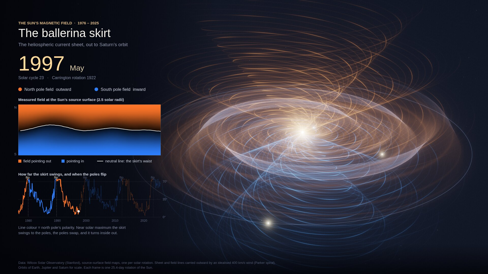
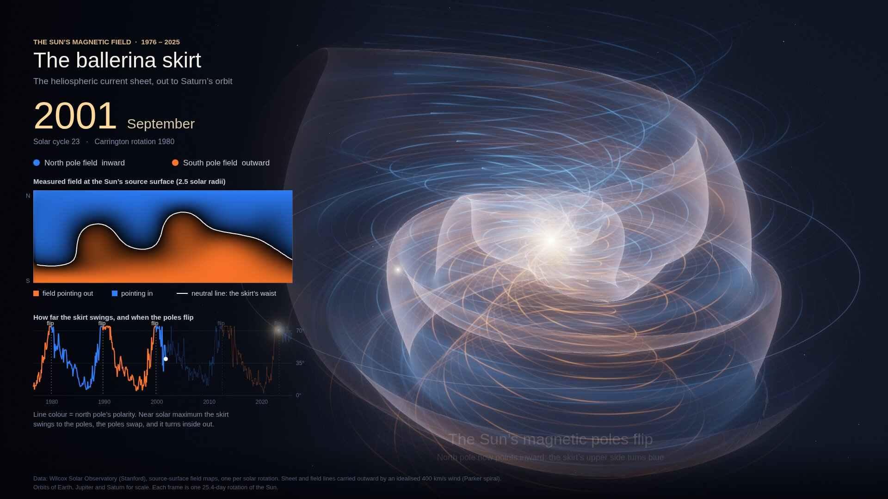

# Heliospheric current sheet ("ballerina skirt") — render spike

Research spike, 2026-10-04: an offline film of the Sun's heliospheric current sheet from
1976 to 2025, built from real Wilcox Solar Observatory (WSO) magnetic-field maps. It's a
look-and-data probe for a possible skymap Layer between the solar-system and nearest-star
scales, not product code.




## Reproduce

```bash
./fetch.sh              # ~14 MB: WSO tilt table + 661 source-surface synoptic maps
python3 parse.py        # -> hcs.json / hcs.js (rotation start dates + 72x30 field grids)
node capture.mjs render.html frames 0 708   # WebGL2 in headless Chromium (SwiftShader), ~1 s/frame
ffmpeg -framerate 24 -i frames/f%04d.png -vf "tpad=stop_mode=clone:stop_duration=3,format=yuv420p" \
  -c:v libx264 -crf 21 -preset slow ballerina-skirt.mp4
```

`capture.mjs` takes `<html> <outDir> <from> <to> [devtoolsPort]`, so the 708 frames can be
split across parallel runs on separate ports. `diagram.py` writes the static SVG of the
ideal Parker spiral and skirt.

## What is real and what is modelled

- **Measured:** the neutral line at 2.5 R☉, from WSO's potential-field source-surface maps
  (radial model R250, one per Carrington rotation). Gaps are filled from the classic model
  (CR 2215–2217, 2302); CR 2258 is partly filled from the previous rotation.
- **Measured:** the polar polarity and the flips. North-pole sign is the mean of the top 3
  latitude rows, smoothed over ±6 rotations. Flips land around 1980, 1990, 2000, 2013 and
  2023.
- **Modelled:** everything beyond the Sun. The sheet is carried outward radially by a
  constant 400 km/s wind (an ideal Parker spiral, 1.07 rad/AU of winding) and is drawn out
  to 10 AU.
- **Sampling:** each frame is one sidereal rotation (25.38 d), so the sheet's spin strobes
  away and only its change in shape shows.

## Technique (portable to skymap's WebGPU renderer)

- **Per-frame volume:** B(r, φ, lat), 150 × 144 × 30. Each shell r samples the map that was
  current at emission time t − r/v, rotated by the Sun's sidereal spin.
- **Surface:** the sheet is the B = 0 isosurface, extracted by marching tetrahedra (~200k
  triangles). Normals are oriented toward positive polarity.
- **Sheet shader:** additive Fresnel. The side facing the viewer is tinted by its polarity
  (orange outward, blue inward), so a polar flip turns the skirt inside out visually. It
  also draws spiral-phase striations (φ + K·r) and outward-moving wind ripples.
- **Field lines:** Parker spirals from source-surface footpoints, as screen-space ribbons
  coloured by local polarity.
- **Post-processing:** 5-level bloom, ACES tone mapping, vignette and grain.
